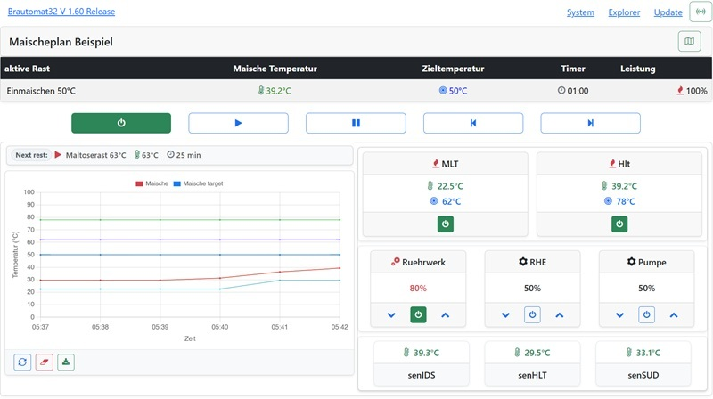
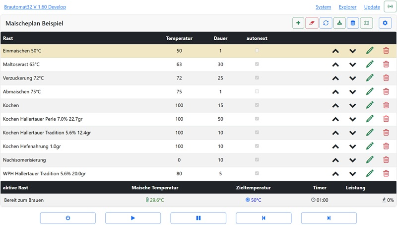
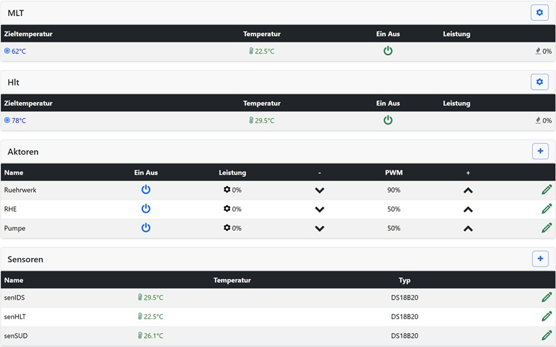
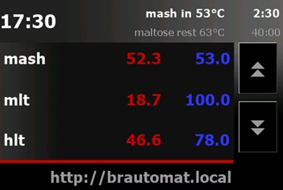
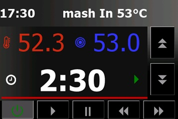
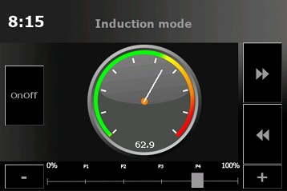

# Brautomat32

Brautomat32 ist eine leistungsfähige Brau- und Gärsteuerung auf Basis des ESP32.
Im Mittelpunkt steht nicht einfach nur das Schalten von Heizquellen, sondern die präzise, reproduzierbare Führung kompletter Brau- und Fermentationsprozesse.

Der Brautomat32 hat mit **InnuAPID** einen eigenen PID-Controller, speziell entwickelt für Heimbrausysteme. Statt grober Ein/Aus-Steuerung arbeitet hier eine adaptive Temperaturregelung, die Maischen, Kochen und Fermentieren außergewöhnlich präzise, ruhig und reproduzierbar macht.

Brautomat32 ist eine vielseitige Steuerplattform für unterschiedliche Heiz- und Aktorkonzepte. Unterstützt werden **GGM-IDS-Induktionskochfelder**, **relaisgesteuerte Heizsysteme** und **Webhook-basierte Aktoren**.

Die Bedienung erfolgt direkt im Browser und ist für PC, Tablet und Smartphone ausgelegt. Optional kann zusätzlich ein Nextion-Touchdisplay eingebunden werden.

## Firmware-Teststatus

Vor jedem Release wird die Firmware automatisiert und mit hoher Detailtiefe gegen ein reales Equipment geprüft. Build, Flash, Webinterface, Prozessabläufe, Restore und Browser-Regressionen sind feste Bestandteile der Release-Test-Workflows.

## Systemprofil und Prozessführung

- Adaptive PID-Regelung mit AutoTune
- Maischeplan-Verwaltung mit automatischem Temperatur- und Zeitablauf
- Fermenter-Modus
- Aktorsteuerung und PWM-Ausgänge
- Temperaturverlauf als Diagramm
- Backup und Restore
- Firmware- und WebUpdate
- Mehrsprachige Benutzeroberfläche

Brautomat32 ist nicht als einfacher Temperatur-Schalter gedacht.
Das Ziel ist eine Steuerung, die Prozesse technisch sauber führt, reproduzierbare Ergebnisse ermöglicht und gleichzeitig offen für unterschiedliche Hardwarekonzepte bleibt.

## Hardware, Betriebsarten und Funktionen

Brautomat32 unterstützt unter anderem:

- bis zu drei Kesselkanäle
  - Maische
  - Sud/MLT
  - HLT/Nachguss
- DS18B20-Sensoren
- PT100x-Sensoren über MAX31865
- Rührwerke, Pumpen und weitere Aktoren
- Fermenterbetrieb mit Heiz-/Kühlpfaden

## Dokumentation

- [Anleitung & Beschreibung](https://innuendopi.gitbook.io/brautomat32/)
- [Forum Hobbybrauer.de (Deutsch)](https://hobbybrauer.de/forum/viewtopic.php?p=486504#p486504)
- [Changelog](https://github.com/InnuendoPi/Brautomat32/blob/main/changelog.md)

## Download

| Release-Typ | Download |
| ----------- | -------- |
| **Release** |  |
| **Development** |  |

## Installation

1. **Brautomat ESP32** herunterladen
2. ZIP-Datei entpacken
3. **Flashen.cmd** ausführen

Das ZIP-Archiv enthält bereits [esptool](https://github.com/espressif/esptool).

Unter Windows nur bei Bedarf:
**CP210x USB to UART Bridge Virtual COM Port (VCP)** - [Silicon Labs Download](https://www.silabs.com/developers/usb-to-uart-bridge-vcp-drivers?tab=downloads)

## Webinterface

Brautomat läuft in aktuellen Browsern auf PC, Tablet und Smartphone.

## Mehrsprachigkeit

Brautomat32 unterstützt (fast) beliebig viele Sprachen.

## Nextion HMI-Touchdisplay (optional)

Brautomat bietet drei Display-Ansichten:

- **Übersicht** - zeigt alle konfigurierten Kessel
- **Maischeansicht** - zeigt Prozessdaten von Kessel 1
- **Manuelle Steuerung (GGM IDS2)** - direkte Leistungssteuerung

_Hinweis: Display-Unterstützung ist optional. Unterstützt werden Nextion ITEAD HMI 3,5" (Basic/Enhanced/Discovery-Serie)._

## Hinweis zu Version 1.60+

Nach einem Update von Version 1.59 oder älter muss **AutoTune** einmal neu durchgeführt werden.
