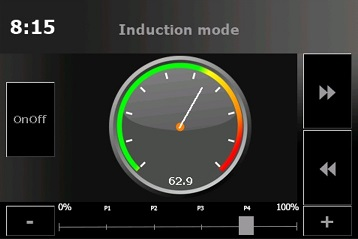

# Brautomat32

Der **Brautomat32** ist ein Brau- und Gärsteuerungssystem auf Basis des ESP32.  
Er bietet eine moderne, intuitiv bedienbare Weboberfläche, die direkt im Browser läuft – auf Tablet, Smartphone oder PC.

---

## 💿 Download

| Release Type | Download |
|---------------|-----------|
| **Release** |  |
| **Development** |  |

---

## ▶️ Installation

* Lade die Datei **Brautomat ESP32** herunter  
* Entpacke das ZIP-Archiv  
* Doppelklicke auf **Flashen.cmd**

Das ZIP-Paket enthält bereits [esptool](https://github.com/espressif/esptool).  

In den meisten Fällen **nicht erforderlich**:  
Treiber **CP210x USB to UART Bridge Virtual COM Port (VCP)** von [Silicon Labs](https://www.silabs.com/developers/usb-to-uart-bridge-vcp-drivers?tab=downloads)

---

## 📓 Funktionen

Der Brautomat ist ein autarkes Brausystem und bietet:

* Steuerung von Induktionskochfeldern  
* Relaissteuerung  
* Webhook-Ansteuerung  
* Integrierter PID-Controller  
* Digitalsensoren DS18B20  
* Analogsensoren PT100x über MAX31865-Verstärker  
* PID-AutoTune  
* Maischeplan-Verwaltung  
  * Automatische Rast-Temperatur-Erreichung und Haltezeit  
  * Zeitgesteuerte Rast-Dauer  
  * Aktorenverwaltung im Maischeplan  
  * Bis zu 30 Maischschritte  
* Steuerung von bis zu drei Kesseln  
  * Maische  
  * Läuter  
  * HLT (Heißwasser)  
* Kessel-Hardwareprofile  
* Gärmodus  
* Steuerung von Aktoren (Rührwerk, Pumpe etc.)  
* PWM-Regelung für Heizelemente  
* Temperaturverlauf im Maischeprozess (Diagramm)  
* MP3-Benachrichtigungen  
* Toast-Meldungen  
* Rezept-Import  
  * kleinerBrauhelfer2  
  * Maische, Malz & Mehr  
  * BrewFather  
* Rezept-Export  
* BrewFather-API für Rezepte und Sude  
* Backup und Restore  
* Nextion 3,5" HMI-Touchdisplay (optional)  
* WebUpdate für einfache Firmware-Updates  
* Mehrsprachige Benutzeroberfläche  
* **[NEU] Dashboard-Ansicht**  
* und vieles mehr…

---

## 📚 Dokumentation

* 📘 [Anleitung & Beschreibung](https://innuendopi.gitbook.io/brautomat32/)  
* 💬 [Forum Hobbybrauer.de (Deutsch)](https://hobbybrauer.de/forum/viewtopic.php?p=486504#p486504)  
* 🕓 [Changelog](https://github.com/InnuendoPi/Brautomat32/blob/main/changelog.md)

---

## 📰 Webinterface

Der Brautomat wird vollständig über einen Webbrowser gesteuert.  
Die Oberfläche ist für PC, Tablet und Smartphone optimiert.

<!-- markdownlint-disable-next-line MD033 -->

<!-- markdownlint-disable-next-line MD033 -->

Webinterface-Screenshots anzeigen

  

---

## 💻 Nextion HMI-Touchdisplay (optional)

Das Nextion-Display bietet drei verschiedene Ansichten:

* **Übersicht** – zeigt alle Kessel  
* **Maischeansicht** – zeigt den Maische-/Sudkessel (erster Kessel)  
* **Manuelle Steuerung (GGM IDS2)** – für direktes Heizen und Kochen  

  
  

_Hinweis: Das Display ist optional. Unterstützt werden ausschließlich Nextion ITEAD HMI-Touchdisplays 3,5"._

---

## 🗺️ Mehrsprachigkeit

Der Brautomat32 unterstützt (fast) beliebig viele Sprachen.  
Jede Sprache besitzt eine eigene JSON-Datei im Ordner `/data/language`.

💡 _Unterstütze das Projekt – übersetze den Brautomat in eine neue Sprache oder verbessere vorhandene Übersetzungen!_

---

## 📙 Platine Version 2.1

Für den **ESP32 D1 Mini NodeMCU** steht eine eigene **Platine** zur Verfügung.  
Sie bietet Schraubklemmen für alle GPIO-Pins, einen dedizierten Anschluss für das Induktionskochfeld **GGM IDS** sowie drei Anschlüsse für DS18B20-Sensoren.  
Die Gerber-Dateien liegen im Ordner `Gehaeuse`.

---

## 📗 Gehäuse

  

---

## 📈 Pinbelegung

Die folgende Belegung basiert auf dem **ESP32 D1 Mini NodeMCU** (z. B. [AZ-Delivery](https://www.az-delivery.de/products/esp32-d1-mini)):

### GPIO-Mapping

 

| Name | GPIO | Input | Output | Beschreibung |
|:------|:------:|:------:|:------:|:--------------------------------------------|
| D0 | GPIO026 | ok | ok | |
| D1 | GPIO022 | ok | ok | |
| D2 | GPIO021 | ok | ok | |
| D3 | GPIO017 | ok | ok | DS18B20 |
| D4 | GPIO016 | ok | ok | |
| D5 | GPIO018 | ok | ok | GGM IDS Interrupt (blau/grün) |
| D6 | GPIO019 | ok | ok | GGM IDS Command (gelb) |
| D7 | GPIO023 | ok | ok | GGM IDS Relais (weiß) |
| D8 | GPIO005 | ok | ok | Buzzer |
| D9 | GPIO027 | ok | ok | SCLK PT100x |
| D10 | GPIO025 | ok | ok | MISO PT100x |
| D11 | GPIO032 | ok | ok | MOSI PT100x |
| D12 | GPIO012 | (ok) | ok | Bootfehler, wenn High (TDI, Strapping) |
| D13 | GPIO004 | ok | ok | CS0 PT100x |
| D14 | GPIO000 | pullUp | (ok) | Muss LOW sein, um Flash-Modus zu starten |
| D15 | GPIO002 | ok | ok | Onboard-LED, muss LOW sein für Flash |
| D16 | GPIO033 | ok | ok | CS1 PT100x |
| D17 | GPIO014 | ok | ok | CS2 PT100x |
| D18 | GPIO015 | ok | ok | |
| D19 | GPIO013 | ok | ok | |
| D20 | GPIO010 | (ok) | (ok) | SD3 SPI-Flash |

⚠️ Pins, die mit dem internen Flash-Speicher verbunden sind (CMD, CLK, SD0 – SD3), sollten nicht für GPIO-Funktionen verwendet werden.

---

## 🔉 MP3-Dateien

_Rechtlicher Hinweis:_  
Die Sounds **„Boxing Bell“**, **„Short School Bell“**, **„Ding Sound Effect“** und **„Success Sound Effect“** stammen aus der **Free Sounds Library**  
🔗 [freesoundslibrary.com](http://www.freesoundslibrary.com)  
📜 Lizenz: **Attribution 4.0 International (CC BY 4.0)** – kostenfrei für kommerzielle und nicht-kommerzielle Nutzung.

---

## 💬 Community & Support

* [GitHub Discussions](https://github.com/InnuendoPi/Brautomat32/discussions)  
* [Fehler oder Ideen melden](https://github.com/InnuendoPi/Brautomat32/issues)  
* ⭐ _Wenn dir das Projekt gefällt, freue dich über einen Stern auf GitHub!_

---
