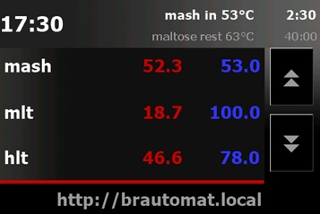
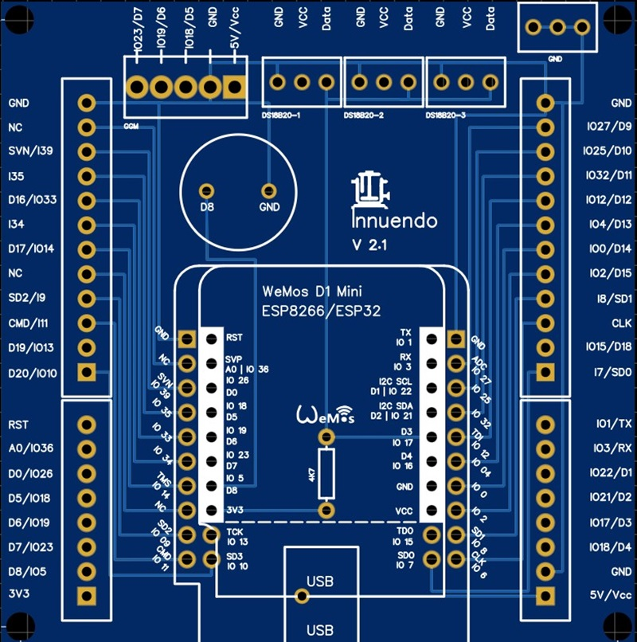

# Brautomat32

**Brautomat32** ist eine Brau- und Gärsteuerung auf Basis des ESP32.
Die Bedienung erfolgt direkt im Browser und ist für PC, Tablet und Smartphone ausgelegt.

**Wichtig für Version 1.60:**
Nach einem Update von Version 1.59 oder älter muss **AutoTune** einmal neu durchgeführt werden.

---

## Download

| Release-Typ | Download |
|-------------|----------|
| **Release** |  |
| **Development** |  |

---

## Installation (Kurzstart)

1. **Brautomat ESP32** herunterladen
2. ZIP-Datei entpacken
3. **Flashen.cmd** ausführen

Das ZIP-Archiv enthält bereits [esptool](https://github.com/espressif/esptool).

Unter Windows nur bei Bedarf:
**CP210x USB to UART Bridge Virtual COM Port (VCP)** - [Silicon Labs Download](https://www.silabs.com/developers/usb-to-uart-bridge-vcp-drivers?tab=downloads)

---

## Funktionen

Brautomat ist eine eigenständige Brausteuerung mit:

* Steuerung von GGM-Induktionskochfeldern
* Relaisbasierter Heizungssteuerung
* Webhook-Ansteuerung
* Integrierter PID-Regelung
* PID-AutoTune
* DS18B20-Digitalsensoren
* PT100x-Analogsensoren über MAX31865
* Maischeplan-Verwaltung
  * automatisches Anfahren und Halten von Rasttemperaturen
  * automatische Rastzeit-Steuerung
  * Aktor-Schaltbefehle in Maischschritten
  * bis zu 30 Maischschritte
* Bis zu 3 Kesselkanäle
  * Maischekessel
  * SUD/MLT-Kessel
  * HLT/Nachguss-Kessel
* Kessel-Hardwareprofile
* Fermenter-Modus (Beta)
* Aktorsteuerung (Rührwerk, Pumpen usw.)
* PWM-Ausgangssteuerung
* Temperaturverlauf (Diagramm)
* MP3-Alarme und Toast-Meldungen
* Rezept-Import
  * kleinerBrauhelfer2
  * Maische Malz und Mehr
  * BrewFather
* Rezept-Export
* BrewFather-API für Rezepte/Sude
* Backup und Restore
* Nextion 3,5" HMI-Touchdisplay (optional)
* WebUpdate für Firmware-Updates
* Mehrsprachige Benutzeroberfläche
* Dashboard-Modus (1.60+)

---

## Dokumentation

* [Anleitung & Beschreibung](https://innuendopi.gitbook.io/brautomat32/)
* [Forum Hobbybrauer.de (Deutsch)](https://hobbybrauer.de/forum/viewtopic.php?p=486504#p486504)
* [Changelog](https://github.com/InnuendoPi/Brautomat32/blob/main/changelog.md)

---

## Webinterface

Brautomat läuft in aktuellen Browsern auf PC, Tablet und Smartphone.

<!-- markdownlint-disable-next-line MD033 -->

<!-- markdownlint-disable-next-line MD033 -->

Webinterface-Screenshots anzeigen

---

## Nextion HMI-Touchdisplay (optional)

Brautomat bietet drei Display-Ansichten:

* **Übersicht** - zeigt alle konfigurierten Kessel
* **Maischeansicht** - zeigt Prozessdaten von Kessel 1
* **Manuelle Steuerung (GGM IDS2)** - direkte Leistungssteuerung

<!-- markdownlint-disable-next-line MD033 -->

<!-- markdownlint-disable-next-line MD033 -->

Display-Screenshots anzeigen

_Hinweis: Display-Unterstützung ist optional. Unterstützt werden Nextion ITEAD HMI 3,5" (Basic/Enhanced/Discovery-Serie)._

---

## Mehrsprachigkeit

Brautomat32 unterstützt (fast) beliebig viele Sprachen.

Unterstütze das Projekt, indem du eine neue Sprache ergänzt oder bestehende Übersetzungen verbesserst.

---

## Platine 2.1

<!-- markdownlint-disable-next-line MD033 -->

<!-- markdownlint-disable-next-line MD033 -->

Screenshot Platine anzeigen

Für den **ESP32 D1 Mini NodeMCU** gibt es eine eigene **Platine** mit:

* Schraubklemmen für GPIOs
* dediziertem GGM-IDS-Anschluss
* drei DS18B20-Sensorports

Die Gerber-Dateien liegen im Ordner `Gehaeuse`.

---

## Gehäuse

<!-- markdownlint-disable-next-line MD033 -->

<!-- markdownlint-disable-next-line MD033 -->

Gehäuse-Screenshots anzeigen

---

## Pinbelegung

Die folgende Belegung gilt für **ESP32 D1 Mini NodeMCU** (z. B. [AZ-Delivery](https://www.az-delivery.de/products/esp32-d1-mini)).

### GPIO-Mapping

<!-- markdownlint-disable-next-line MD033 -->

<!-- markdownlint-disable-next-line MD033 -->

ESP32-Pinout-Screenshots anzeigen

 

| Name | GPIO | Input | Output | Beschreibung |
|:------|:------:|:------:|:------:|:--------------------------------------------|
| D0 | GPIO026 | ok | ok | |
| D1 | GPIO022 | ok | ok | |
| D2 | GPIO021 | ok | ok | |
| D3 | GPIO017 | ok | ok | DS18B20 |
| D4 | GPIO016 | ok | ok | |
| D5 | GPIO018 | ok | ok | GGM IDS Interrupt (blau/grün) |
| D6 | GPIO019 | ok | ok | GGM IDS Command (gelb) |
| D7 | GPIO023 | ok | ok | GGM IDS Relais (weiß) |
| D8 | GPIO005 | ok | ok | Buzzer |
| D9 | GPIO027 | ok | ok | SCLK PT100x |
| D10 | GPIO025 | ok | ok | MISO PT100x |
| D11 | GPIO032 | ok | ok | MOSI PT100x |
| D12 | GPIO012 | (ok) | ok | Bootfehler bei High-Pegel (TDI, Strapping) |
| D13 | GPIO004 | ok | ok | CS0 PT100x |
| D14 | GPIO000 | pullUp | (ok) | Muss LOW sein für Flash-Modus |
| D15 | GPIO002 | ok | ok | Onboard-LED, muss LOW sein für Flash |
| D16 | GPIO033 | ok | ok | CS1 PT100x |
| D17 | GPIO014 | ok | ok | CS2 PT100x |
| D18 | GPIO015 | ok | ok | |
| D19 | GPIO013 | ok | ok | |
| D20 | GPIO010 | (ok) | (ok) | SD3 SPI-Flash |

Pins am internen Flash (CMD, CLK, SD0-SD3) sollten nicht für reguläre GPIO-Funktionen verwendet werden.

---

## MP3-Dateien

Rechtlicher Hinweis:
"Boxing Bell" (info), "Short School Bell" (error), "Ding sound effect" (warning) und "Success sound effect" (success) stammen aus der **Free Sounds Library**.

* Quelle: [freesoundslibrary.com](http://www.freesoundslibrary.com)
* Lizenz: **Attribution 4.0 International (CC BY 4.0)** (kommerzielle und nicht-kommerzielle Nutzung)

---

## Community und Support

* [GitHub Discussions](https://github.com/InnuendoPi/Brautomat32/discussions)
* [Fehler oder Ideen melden](https://github.com/InnuendoPi/Brautomat32/issues)
* Wenn dir das Projekt gefällt, gib ihm einen Stern auf GitHub.

---
