# Brautomat32

The Brautomat is a brewing controller for ESP32 D1 Mini NodeMCU and ESP8266 D1 mini. The Brautomat offers an intuitive, easy-to-use control system.\
The firmware is available in three versions:

  

> **Note:** With version 1.50+ all Brautomat versions are published in the Brautomat32 github repository.

***

## 💿 Download

ESP32 D1 Mini NodeMCU and Brautomat32pIO is recommended.

  

> **note:**

* You cannot update (file or WebUpdate) from Brautomat32 to Brautomat32pIO due to different partition layouts. You need to reflash the firmware.\
* For compatibility reasons, a Brautomat32 version based on ESP32-IDF4 still exists for the ESP32 but due to end of life IDF4 not recommended.

## ▶️ Installation

* Download Brautomat
  * [ESP32 IDF5](https://github.com/InnuendoPi/Brautomat32/raw/refs/heads/main/Brautomat32pIO.zip): Brautomat32pIO.zip
  * [ESP32 IDF4](https://github.com/InnuendoPi/Brautomat32/raw/refs/heads/main/Brautomat32.zip): Brautomat32.zip
  * [ESP8266](https://github.com/InnuendoPi/Brautomat32/raw/refs/heads/main/Brautomat.zip): Brautomat.zip
* unzip file
* Double-click file “Flashen.cmd”

ZIP files includes [esptool](https://github.com/espressif/esptool).

In most cases not required: Hardware driver CP210x USB to UART Bridge Virtual COM Port (VCP): [Silicon Labs](https://www.silabs.com/developers/usb-to-uart-bridge-vcp-drivers?tab=downloads)

## 📓 Features

Brautomat is a stand alone brewing device and offers:

* induction hob controller
* relay controller
* webhook controller
* integrated PID-Controller
* digital sensors DS18B20
* analog sensors PT100x with MAX31865 Amplifier
* PID-AutoTune
* mash plan management
  * full automated rest temperature reach & hold
  * full automated rest duration timer function
  * actors can be managed through mashplan
  * Mash plans with up to 20 steps
* Controll up to 3 kettles
  * Mash
  * MLT
  * HLT
* Kettle profiles
* Controlling actors like agitator, pumps etc.
* PWM for heating elements
* Temperature progression in the mashing process (line chart)
* MP3 alerts
* Toasts messages
* Recipe import
  * kleinerBrauhelfer2
  * Maische Malz und Mehr
  * BrewFather
* Recipe export
* Nextion 3,5" HMI Touchdisplay (optional)
* WebUpdate for easy firmware updates
* Support for different languages
* and much more

## 📚 Documentation

Detailed instructions availible on gitbook (german): [Instructions & description](https://innuendopi.gitbook.io/brautomat32/)\
Forum Hobbybrauer (german): [Discussion & News](https://hobbybrauer.de/forum/viewtopic.php?p=486504#p486504)\
Last changes: [Changelog](https://github.com/InnuendoPi/Brautomat32/blob/main/changelog.md)

## 📰 WebInterface

The Brautomat is operated via web browser. You can use your tablet, smartphone or pc.

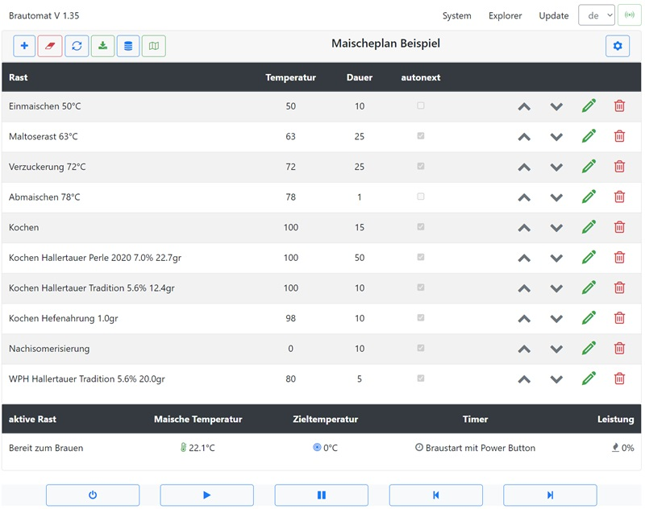\
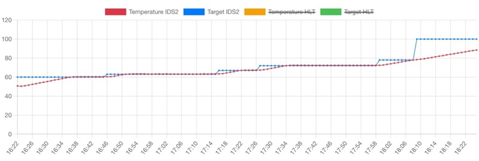\
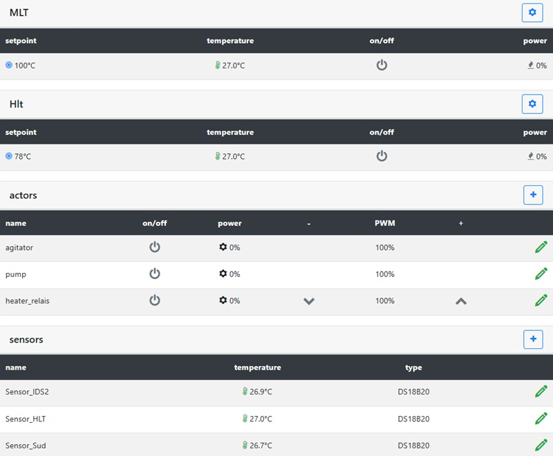

## 💻 Nextion HMI Touchdisplay

Brautomat offers three different displays:

* Overview
* Mash tun
* Manual control cooking

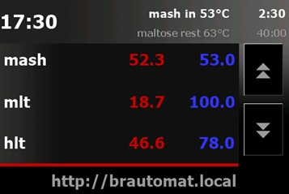 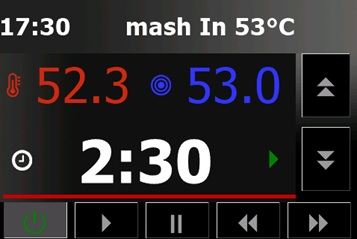 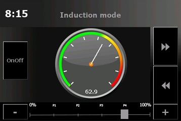

_Note: the display is an optional extension. Only Nextion ITEAD HMI 3.5" Touchdisplays are supported._

## 🗺️ Multilingual

Brautomat32 supports (almost) any number of languages. Each language has its own language file. The language files in JSON format are stored in the folder data/language.

_Support this project and translate Brautomat into a new language or correct existing language files!_

## 📙 Circuit board 2.1

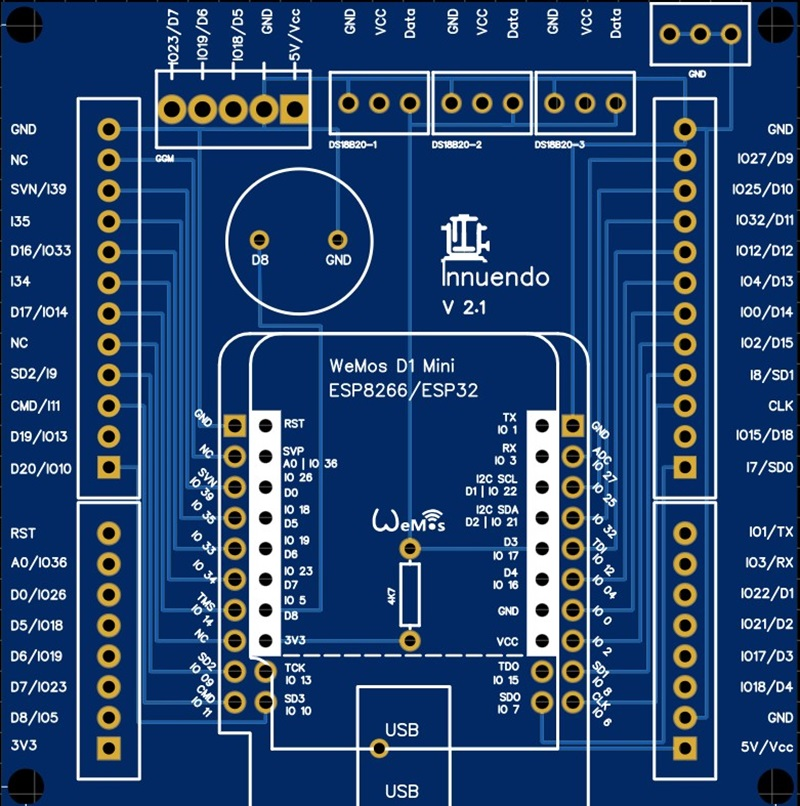

A board for the Arduino ESP controller is available. In addition to the screw terminal blocks for the GPIOs, the board also offers a separate connection for the induction hob and three connections for temperature sensors. The Gerber file is stored in the Gehaeuse folder. The board 2.1 can be operated with both the ESP8266 and the ESP32.

## 📗 Case

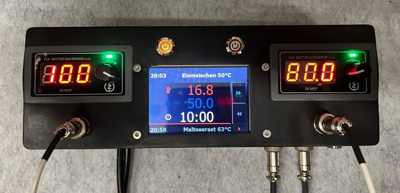
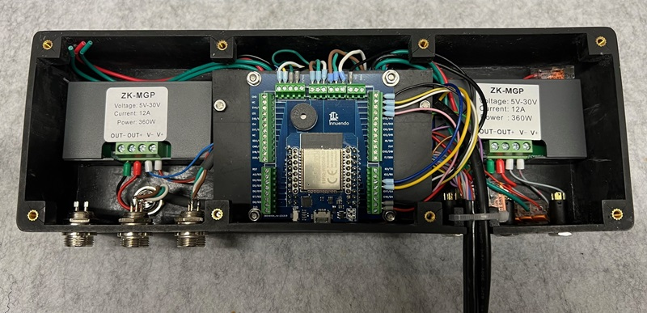

## Pinout

The ESP32 D1 offers a pinout suitable for the ESP8266 (GPIO D0 to D8). The pin assignment shown is based on the ESP32 D1 Mini NodeMCU module from [AZ-Delivery](https://www.az-delivery.de/products/esp32-d1-mini)

GPIO mapping:

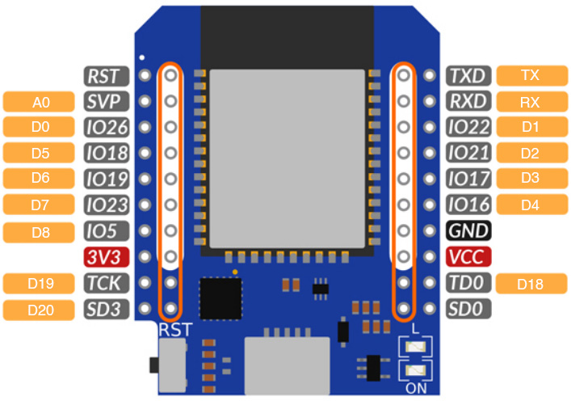 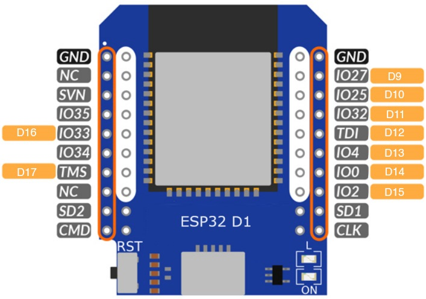

| Name | GPIO    | Input  | Output | notes                                         |
| ---------- | ------- | ------ | ------ | --------------------------------------------- |
| D0         | GPIO026 | ok     | ok     |                                               |
| D1         | GPIO022 | ok     | ok     |                                               |
| D2         | GPIO021 | ok     | ok     |                                               |
| D3         | GPIO017 | ok     | ok     | DS18B20                                       |
| D4         | GPIO016 | ok     | ok     |                                               |
| D5         | GPIO018 | ok     | ok     | GGM IDS Interrupt blue/green                  |
| D6         | GPIO019 | ok     | ok     | GGM IDS Command yellow                        |
| D7         | GPIO023 | ok     | ok     | GGM IDS Relay white                           |
| D8         | GPIO005 | ok     | ok     | Buzzer                                        |
| D9         | GPIO027 | ok     | ok     | SCLK                                          |
| D10        | GPIO025 | ok     | ok     | MISO                                          |
| D11        | GPIO032 | ok     | ok     | MOSI                                          |
| D12        | GPIO012 | (ok)   | ok     | TDI, boot fails if pulled high, strapping pin |
| D13        | GPIO004 | ok     | ok     | CS0                                           |
| D14        | GPIO000 | pullUp | (ok)   | must be low to enter flash mode               |
| D15        | GPIO002 | ok     | ok     | onboard LED, must be low to enter flash mode  |
| D16        | GPIO033 | ok     | ok     | CS1                                           |
| D17        | GPIO014 | ok     | ok     | CS2                                           |
| D18        | GPIO015 | ok     | ok     |                                               |
| D19        | GPIO013 | ok     | ok     |                                               |
||||||

Pins connected to onboard flash and not recommended for GPIO use: CMD (IO11), CLK (IO6), SD0/SDD (IO7), SD1 (IO8), SD2 (IO9) and SD3 (IO10)

## 🔉MP3 files

_Legal note: "Boxing Bell" (info), "Short School Bell" (error), "Ding sound effect" (warning) and "Success sound effect" (success) mp3 from Free Sounds Library_ [_http://www.freesoundslibrary.com_](http://www.freesoundslibrary.com) _Licence: Attribution 4.0 International (CC BY 4.0). You are allowed to use sound effects free of charge and royalty free in your multimedia projects for commercial or non-commercial purposes._
