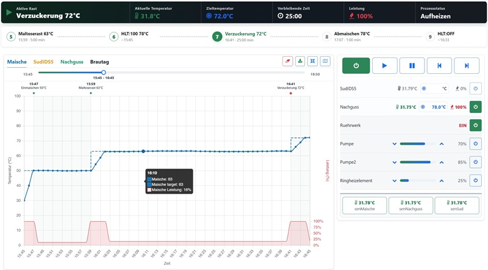
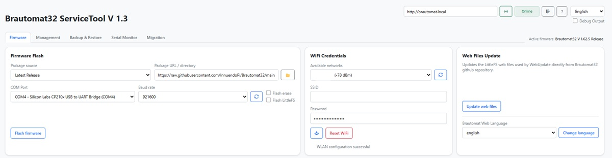

# Brautomat32

Brautomat32 is a powerful brewing and fermentation controller based on the ESP32.
Its focus is not simple heater switching, but precise and repeatable control of complete brewing and fermentation processes.

Brautomat32 uses its own PID controller, **InnuAPID**, developed specifically for home brewing systems. Instead of crude on/off switching, it applies adaptive temperature control that makes mash, boil, and fermentation exceptionally precise, stable, and repeatable.

Brautomat32 is a versatile control platform for different heating and actuator concepts. Supported hardware includes **GGM IDS induction cooktops**, **relay-controlled heating systems**, and **webhook-based actuators**.

Operation happens directly in the browser and is designed for PC, tablet, and smartphone. An optional Nextion touch display can also be added.

## Firmware Test Status

Before every release, the firmware is tested automatically and in depth against real equipment. Build, flash, web interface, process flows, restore, and browser regressions are fixed parts of the release test workflows.

## System Profile and Process Control

- Adaptive PID control with AutoTune
- Mash plan management with automatic temperature and timing flow
- Fermenter mode
- Actuator control and PWM outputs
- Temperature charting
- Backup and restore
- Firmware and web update
- Multilingual user interface

Brautomat32 is not designed as a simple temperature switch.
The goal is a controller that runs processes cleanly, delivers repeatable results, and remains open to different hardware concepts.

## Hardware, Operating Modes, and Functions

Brautomat32 supports, among other things:

- up to three kettle channels
  - Mash
  - Boil/MLT
  - HLT/Sparge
- DS18B20 sensors
- PT100x sensors via MAX31865
- Agitators, pumps, and additional actuators
- Fermenter operation with heating and cooling paths

## Documentation

- [Guide & Documentation](https://innuendopi.gitbook.io/brautomat32/)
- [Hobbybrauer.de forum (German)](https://hobbybrauer.de/forum/viewtopic.php?p=486504#p486504)
- [Changelog](https://github.com/InnuendoPi/Brautomat32/blob/main/changelog.md)

## Download

| Release-Typ | Download |
| ----------- | -------- |
| **Release** |  |
| **Development** |  |
| **ServiceTool** | [Aktuelles ServiceTool-Release](https://github.com/InnuendoPi/ServiceTool/releases/latest) |

## Installation

Download [Brautomat ServiceTool](https://github.com/InnuendoPi/ServiceTool/releases/latest) for Windows, macOS or linux

Alternatively on Windows just run

1. Download **Brautomat ESP32**
2. Extract the ZIP archive
3. Run **Flashen.cmd**

The ZIP archive already includes [esptool](https://github.com/espressif/esptool).

On Windows, only if needed:
**CP210x USB to UART Bridge Virtual COM Port (VCP)** - [Silicon Labs Download](https://www.silabs.com/developers/usb-to-uart-bridge-vcp-drivers?tab=downloads)

## Web Interface

Brautomat runs in current browsers on PC, tablet, and smartphone.

## Multilingual

Brautomat32 supports almost any number of languages.

## Nextion HMI Touch Display (optional)

Brautomat offers three display views:

- **Overview** - shows all configured kettles
- **Mash view** - shows process data of kettle 1
- **Manual control (GGM IDS2)** - direct power control

_Note: Display support is optional. Supported devices are Nextion ITEAD HMI 3.5" (Basic/Enhanced/Discovery series)._

## Note for Version 1.60+

After updating from version 1.59 or older, **AutoTune** must be run once again.
