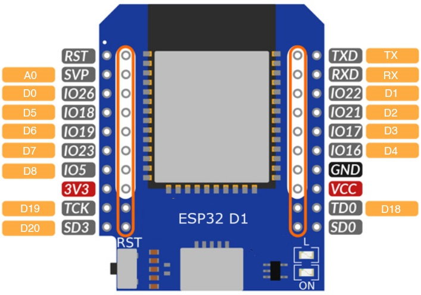

# Brautomat32

  

The Brautomat is a brewing controller for the ESP8266 and ESP32 D1 mini. The Brautomat offers an intuitive, easy-to-use control system.

> **Note:** With version 1.50 all Brautomat versions (Brautomat (ESP8266), Brautomat32 (ESP32 IDF4) and Brautomat32pIO (ESP32 IDF5)) are published in the Brautomat32 repository.

***

## 💿 Download

The Brautomat can be operated on an ESP32 or an ESP8266. The ESP32 with the Brautomat32pIO firmware is recommended.

  

For compatibility reasons, a Brautomat32 version based on ESP32-IDF4 also exists for the ESP32.

## ▶️ Installation

Hardware driver CP210x USB to UART Bridge Virtual COM Port (VCP): [Silicon Labs](https://www.silabs.com/developers/usb-to-uart-bridge-vcp-drivers?tab=downloads)

* Download Brautomat
* unzip file
* Double-click on the “Flashen.cmd” file

ZIP files includes [esptool](https://github.com/espressif/esptool).

## 📓 Features

Brautomat is a stand alone brewing device and offers:

* induction hob controller
* relay controller
* webhook controller
* integrated PID-Controller
* digital sensors DS18B20
* analog sensors PT100x with MAX31865 Amplifier
* PID-AutoTune
* mash plan management
  * full automated rest temperature reach & hold
  * full automated rest duration timer function
  * Mash plans with up to 20 steps
* Controll up to 3 kettles
  * Mash
  * MLT
  * HLT
* Controlling actors like agitator, pumps etc.
* PWM for heating elements
* Temperature progression in the mashing process (line chart)
* MP3 alerts
* Toasts messages
* Recipe import
  * kleinerBrauhelfer2
  * Maische Malz und Mehr
  * BrewFather
* Recipe export
* Nextion 3,5" HMI Touchdisplay (optional)
* WebUpdate for easy firmware updates
* Support for different languages

## 📚 Documentation

Detailed instructions availible on gitbook: [Instructions & description](https://innuendopi.gitbook.io/brautomat32/)\
The Hobby Brewers Forum (german): [Discussion & News](https://hobbybrauer.de/forum/viewtopic.php?p=486504#p486504)\
Last changes: [Changelog](https://github.com/InnuendoPi/Brautomat32/blob/main/changelog.md)

## 📰 WebInterface

The Brautomat is web browser controlled.

\
\

## 💻 Nextion HMI Touchdisplay

Brautomat offers three different displays:

* Overview
* Mash tun
* Manual control cooking

  

_Note: the display is an optional extension. Only Nextion ITEAD HMI 3.5" Touchdisplays are supported._

## 🗺️ Multilingual

Brautomat32 supports (almost) any number of languages. Each language has its own language file. The language files in JSON format are stored in the folder data/language.

_Supported the project and translated the Brautomat into a new language or corrected existing language files!_

## 📙 Circuit board 2.1

A board for the Arduino ESP controller is available. In addition to the screw terminal blocks for the GPIOs, the board also offers a separate connection for the induction hob and three connections for temperature sensors. The Gerber file is stored in the Tools folder. The board 2.0 can be operated with both the ESP8266 and the ESP32.

## 📗 Case

## Pinout

The ESP32 D1 offers a pinout suitable for the ESP8266 (GPIO D0 to D8). The pin assignment shown is based on the ESP32 D1 Mini NodeMCU module from [AZ-Delivery](https://www.az-delivery.de/products/esp32-d1-mini)

GPIO mapping:

 

| Name | GPIO    | Input  | Output | notes                                         |
| ---------- | ------- | ------ | ------ | --------------------------------------------- |
| D0         | GPIO026 | ok     | ok     |                                               |
| D1         | GPIO022 | ok     | ok     |                                               |
| D2         | GPIO021 | ok     | ok     |                                               |
| D3         | GPIO017 | ok     | ok     | DS18B20                                       |
| D4         | GPIO016 | ok     | ok     |                                               |
| D5         | GPIO018 | ok     | ok     | GGM IDS Interrupt blue/green                  |
| D6         | GPIO019 | ok     | ok     | GGM IDS Command yellow                        |
| D7         | GPIO023 | ok     | ok     | GGM IDS Relay white                           |
| D8         | GPIO005 | ok     | ok     | Buzzer                                        |
| D9         | GPIO027 | ok     | ok     | SCLK                                          |
| D10        | GPIO025 | ok     | ok     | MISO                                          |
| D11        | GPIO032 | ok     | ok     | MOSI                                          |
| D12        | GPIO012 | (ok)   | ok     | TDI, boot fails if pulled high, strapping pin |
| D13        | GPIO004 | ok     | ok     | CS0                                           |
| D14        | GPIO000 | pullUp | (ok)   | must be low to enter flash mode               |
| D15        | GPIO002 | ok     | ok     | onboard LED, must be low to enter flash mode  |
| D16        | GPIO033 | ok     | ok     | CS1                                           |
| D17        | GPIO014 | ok     | ok     | CS2                                           |
| D18        | GPIO015 | ok     | ok     |                                               |
| D19        | GPIO013 | ok     | ok     |                                               |
||||||

Pins connected to onboard flash and not recommended for GPIO use: CMD (IO11), CLK (IO6), SD0/SDD (IO7), SD1 (IO8), SD2 (IO9) and SD3 (IO10)

## 🔉MP3 files

_Legal note: "Boxing Bell" (info), "Short School Bell" (error), "Ding sound effect" (warning) and "Success sound effect" (success) mp3 from Free Sounds Library_ [_http://www.freesoundslibrary.com_](http://www.freesoundslibrary.com) _Licence: Attribution 4.0 International (CC BY 4.0). You are allowed to use sound effects free of charge and royalty free in your multimedia projects for commercial or non-commercial purposes._
