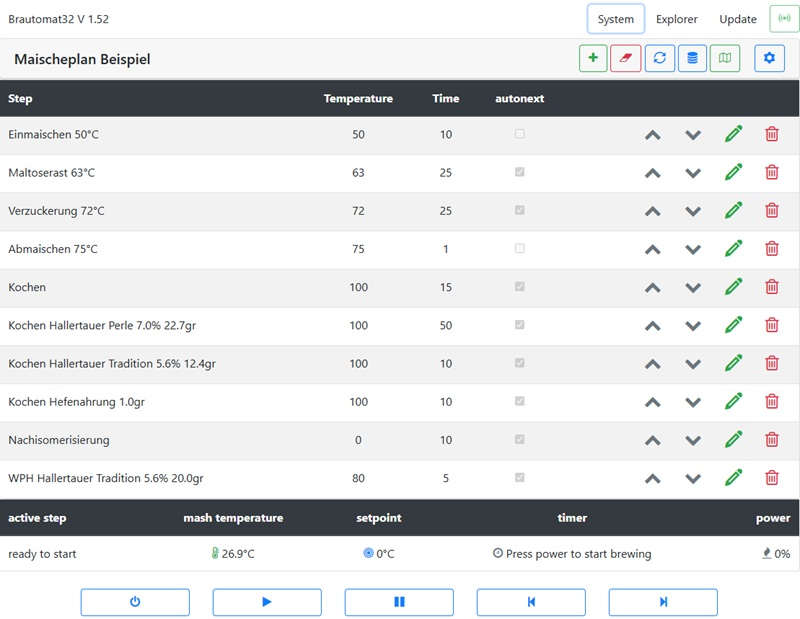

# Der Brautomat32

  

Der Brautomat ist eine Brausteuerung für den ESP8266 und ESP32 D1 mini. Der Brautomat bietet eine intuitiv einfach zu bedienende Steuerung.

> **Hinweis:** Mit Version 1.50 werden alle Brautomat Versionen (Brautomat (ESP8266), Brautomat32 (ESP32 IDF4) und Brautomat32pIO (ESP32 IDF5)) im Repository Brautomat32 veröffentlicht.

***

## 💿 Download

Der Brautomat kann auf einem ESP8266 oder einem ESP32 eingesetzt werden.

 

Aus Kompatibilitätsgründen existiert für den ESP32 auch eine ESP32-IDF4 Version (ehemals Brautomat32):

> **Hinweis:** Die ESP32 Varianten IDF4 und IDF5 (ehemals Brautomat32 und Brautomat32pIO) sind nicht kompatiblel. Ein WebUpdate von IDF4 auf IDF5 ist nicht möglich.

## ▶️ Installation

Hardware driver CP210x USB to UART Bridge Virtual COM Port (VCP): [Silicon Labs](https://www.silabs.com/developers/usb-to-uart-bridge-vcp-drivers?tab=downloads)

* Brautomat herunterladen
* ZIP Datei entpacken
* Doppelklick auf die Datei "Flashen.cmd"

Das ZIP Archiv enthält [esptool](https://github.com/espressif/esptool).

## Hauptfunktionen

* Steuerung der Induktionskochfeld
* Steuerung per Relais
* Steuerung über Webhook
* integrierter PID-Controller
* PID-AutoTune
* Temperatursensoren
  * Dallas DS18B20
  * PT100 und PT1000 (MAX31865)
* Maischeplan
  * Automatisches Anfahren und halten der Rasttemperaturen
  * Würzekochen
  * Alarmierung für Hopfengaben
  * Bis zu 20 Teilschritte
* Verwaltung von Maischeplänen
* Steuerung von bis zu 3 Kochfeldern
  * MaischeSud
  * Sudpfanne (MLT)
  * Nachguss (HLT)
* Steuerung von Aktoren, wie bspw. Rührwerk, Pumpen, etc.
* PWM für Aktoren
* Audio Alarme
  * MP3 Alarme
  * Akkustische Signale (Piezo Buzzer)
* Toasts Nachrichten
* Temperaturverlauf im Maischeprozess als Grafik (line chart)
* Rezept Import
  * kleinen Brauhelfer2
  * Maische Malz und Mehr
  * BrewFather
* Rezept Export
* Unterstützung für 3,5" HMI Touchdisplay Nextion

## 📚 Dokumentation

Eine ausführliche Anleitung liegt auf gitbook: [Anleitung & Beschreibung](https://innuendopi.gitbook.io/brautomat32/)\
Das Hobbybrauer Forum: [Diskussion & Neuigkeiten](https://hobbybrauer.de/forum/viewtopic.php?p=486504#p486504)\
Die letzten Änderungen: [Changelog](https://github.com/InnuendoPi/Brautomat32/blob/main/changelog.md)

## 📰 WebInterface

Der Brautomat wird über einen WebBrowser gesteuert.

## 💻 Nextion HMI Touchdisplay

* Kesselübersicht
* MaischeSud
* Manuelle Steuerung Kochen

  

## 🗺️ Multilingual

Der Brautomat32 unterstützt (nahezu) beliebig viele Sprachen. Jede Sprache hat eine eigene Sprachdatei. Die Sprachdateien im JSON Format sind im Ordner data/language hinterlegt.

_Unterstützte das Projekt und übersetze den Brautomat32 in eine neue Sprache bzw. korrigiere vorhandene Sprachdateien!_

## 📙 Platine 2.1

Eine Platine für den Arduino ESP Controller ist verfügbar. Die Platine bietet neben den Schraubklemmblöcken für die GPIOs auch einen separaten Anschluss für das Induktionskochfeld sowie drei Anschlüsse für Temperatursensoren. Die Gerber Datei ist im Ordner Tools gespeichert. Die Platine 2.0 kann sowohl mit dem ESP8266, als auch mit dem ESP32 betrieben werden.

## 📗 Gehäuse

## 📘 Pin-Belegung

Der ESP32 D1 bietet ein Pinout passend zum ESP8266 (GPIO D0 bis D8). Die dargestellte Pinbelegung basiert auf dem Modul ESP32 D1 Mini NodeMCU von [AZ-Delivery](https://www.az-delivery.de/products/esp32-d1-mini)

GPIO Zuordnung:

 

| Bezeichner | GPIO    | Input  | Output | Beschreibung                                  |
| ---------- | ------- | ------ | ------ | --------------------------------------------- |
| D0         | GPIO026 | ok     | ok     |                                               |
| D1         | GPIO022 | ok     | ok     |                                               |
| D2         | GPIO021 | ok     | ok     |                                               |
| D3         | GPIO017 | ok     | ok     | DS18B20                                       |
| D4         | GPIO016 | ok     | ok     |                                               |
| D5         | GPIO018 | ok     | ok     | GGM IDS Interrupt blue/green                  |
| D6         | GPIO019 | ok     | ok     | GGM IDS Command yellow                        |
| D7         | GPIO023 | ok     | ok     | GGM IDS Relay white                           |
| D8         | GPIO005 | ok     | ok     | Buzzer, outputs PWM signal at boot            |
| D9         | GPIO027 | ok     | ok     | SCLK                                          |
| D10        | GPIO025 | ok     | ok     | MISO                                          |
| D11        | GPIO032 | ok     | ok     | MOSI                                          |
| D12        | GPIO012 | (ok)   | ok     | TDI, boot fails if pulled high                |
| D13        | GPIO004 | ok     | ok     | CS0                                           |
| D14        | GPIO000 | pullUp | (ok)   | must be low to enter flash mode               |
| D15        | GPIO002 | ok     | ok     | onboard LED, must be low to enter flash mode  |
| D16        | GPIO033 | ok     | ok     | CS1                                           |
| D17        | GPIO014 | ok     | ok     | CS2, outputs PWM signal at boot               |
| D18        | GPIO015 | ok     | ok     | outputs PWM signal at boot                    |
| D19        | GPIO013 | ok     | ok     |                                               |
| D20        | GPIO010 | (ok)   | (ok)   | SD3 SPI flash                                 |
||||||

Pins connected to the integrated SPI flash and not recommended for other use: CLK (IO6), SD0/SDD (IO7), SD1 (IO8), SD2 (IO9), SD3 (IO10), CMD (IO11)\
GPIOs 34 to 39 are input only pins.

## Changelog

Version 1.50

* Update:       Arduino core 3.1.2 pioArduino 53.03.12 with Fix #10972 (String nullptr)
* Geändert:     Webhook URL für Maischekessel aktiviert
* Geändert:     Profile um Webhook URL erweitert
* Neu:          Sonderbefehl SUDPROFIL
* Neu:          Sonderbefehl HLTPROFIL, alternativ NACHGUSSPROFIL
* Neu:          Sonderbefehl MAISCHEPROFIL als Alternative für IDSPROFIL
* Geändert:     Kesselprofile für Sud und Nachguss hinzugefügt
* Geändert:     WebIf Optimierung abgeschlossen
* Geändert:     Kessel Sud für die Verwendung von Webhooks erweitert
* Geändert:     einheitliche Optik für die Einstellungen Kessel Maische, Sud an Nachguss
* Gerändert:    Nachguss Tab Temperatursteuerung eingefügt
* Geändert:     Button Nachguss löschen entfernt. Funktion wird mit Auswahl deaktiviert ausgeführt
* Downgrade:    Arduino core 3.1.1 wegen Fehler in 53.03.12 (Exception)
* Geändert:     Nachguss für Verwendung mit IDS erweitert (wegen Downgrade noch nicht abgeschlossen)
* Geändert:     Verarbeitung der Kettle Parameter url, dutycycle und invert überarbeitet
* Update:       Arduino core 3.1.2
* Geändert:     träges WebIf Part 4: Ausblenden von Objekten überarbeitet
* Geändert:     träges WebIf Part 3: request Zeitkorrektur nach Stromlos/-Ausfall überarbeitet
* Geändert:     träges WebIf Part 2: request & response handling überarbeitet
* Fix:          träges WebIf Part 1: Server response mime Format für JSON korrigiert
* Geändert:     Abfrageintervall Sensoren von Minimum SampleTime MAISCHE, SUD und HLT auf festen Wert 2000ms gesetzt
* Geändert:     neuer Parameter DutyCycle im Relais Modus (1000ms bis 60000ms). Default 5000
* Geändert:     InnuAPID Bibliothek Übergabe KettleID für debug Ausgaben hinzugefügt (default 0)
* Geändert:     InnuAPID Bibliothek Berechnung der benötigten Leistung wenn lastTime null ist
* Fix:          Fehler in setProfil D Parameter behoben
* Update:       VSCode 1.97
* Update:       Dallas Temperature Bibliothek 4.0.4

Version 1.49

Die Version 1.49 ist ein Zwischenupdate für alle Bautomat versionen (ESP8266 und ESP32 (Brautomat32, Brautomat32pIO). Nach dem Zwischenupdate kann direkt auf Version 1.50 aktualisiert werden

## 🔉MP3 Dateien

_Legal note: "Boxing Bell" (info), "Short School Bell" (error), "Ding sound effect" (warning) und "Success sound effect" (success) mp3 von Free Sounds Library_ [http://www.freesoundslibrary.com](http://www.freesoundslibrary.com) _Licence: Attribution 4.0 International (CC BY 4.0). You are allowed to use sound effects free of charge and royalty free in your multimedia projects for commercial or non-commercial purposes._
