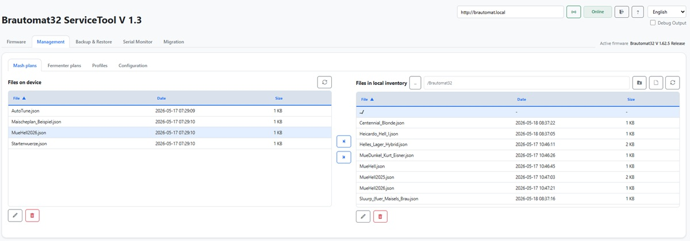
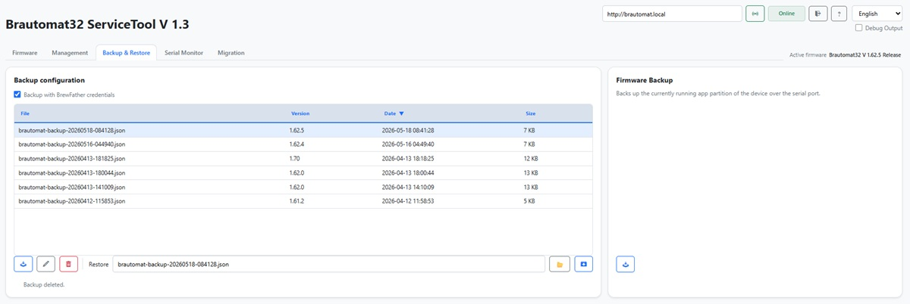
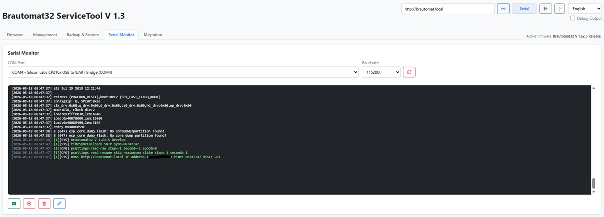

# Brautomat32 ServiceTool

Brautomat32 ServiceTool is the desktop companion for Brautomat32 devices.

It provides:

- configuration backup and restore
- firmware flashing and firmware backup
- web files update
- WiFi provisioning
- inventory management for recipes, fermenter plans, and profiles
- serial monitor
- Telegraf telemetry forwarding to CSV, InfluxDB v2, PostgreSQL, MariaDB/MySQL, and MQTT
- migration workflow for partition/layout changes
- optional local test-runner integration

## End-User Distribution

Brautomat32 ServiceTool is distributed as a complete desktop application.

A bundled `esptool` copy is included with the packaged end-user builds.
If no bundled copy is available in the current runtime environment, the tool downloads a matching `esptool` version automatically on first use.

The ServiceTool checks the public `ServiceTool/version.json` manifest for updates at startup and when the update button is clicked.
If a newer version is available, the matching ZIP package is downloaded, verified by SHA256, and the download folder is opened.
The user then extracts the ZIP and replaces the old ServiceTool version manually.

## End-User Start

### Windows

1. Create any directory for the ServiceTool.
2. Copy `Brautomat32ServiceTool.exe` into that directory.
3. Start the executable.

### Linux

1. Create any directory for the ServiceTool.
2. Copy `Brautomat32ServiceTool.AppImage` into that directory.
3. Make it executable:

```bash
chmod +x Brautomat32ServiceTool.AppImage
```

4. Start it:

```bash
./Brautomat32ServiceTool.AppImage
```

### macOS

1. Extract `Brautomat32ServiceTool-macos.zip`.
2. Move `Brautomat32ServiceTool.app` into any directory.
3. Start the app bundle.
4. The packaged app opens the local UI in the browser on `http://127.0.0.1:<port>`.
   By default the tool uses port `8765`. If that port is already in use, it selects a free local port automatically.
5. If macOS shows `Brautomat32ServiceTool is damaged and can't be opened`, remove the quarantine attribute once in Terminal:

```bash
xattr -dr com.apple.quarantine /path/to/Brautomat32ServiceTool.app
```

6. If macOS still blocks the first start, open the app once via Finder using `Open` and confirm the security prompt.
7. The app bundle can stay in `Downloads`, but writable runtime data is stored separately in:

```text
~/Library/Application Support/Brautomat32ServiceTool
```

Typical runtime folders created there are `logs`, `cache`, `backups`, and `inventar`.

## Runtime Layout

The application serves static files from the bundled `static` directory.

At runtime it separates application files from writable data:

- bundled application files stay inside the packaged app location
- bundled `esptool` is resolved relative to the packaged app location
- writable runtime data is stored in a dedicated data directory

Runtime data includes:

- `backups`
- `logs`
- `cache`
- `inventar`
- `config.json`

Runtime data location:

- Windows packaged app: next to the executable
- Linux AppImage: `~/.local/share/Brautomat32ServiceTool`
- macOS app bundle: `~/Library/Application Support/Brautomat32ServiceTool`
- source run: next to `app.py`

These runtime folders are intentionally excluded from git.

## Using the ServiceTool

When the ServiceTool starts, it first checks the selected COM port and then the network connection to the Brautomat. The current connection state is shown directly in the status badge. The ServiceTool needs a few seconds at startup to detect the serial connection and WiFi availability.

The following status states show the current connection progress and indicate which ServiceTool functions are already available.

- `No device`: No Brautomat has been detected yet. Check the USB cable, the selected COM port, or the local network connection.


- `Checking`: The ServiceTool is currently checking serial and network access. This status appears during startup and after manual device checks.


- `Serial`: A Brautomat was found on the selected COM port. Basic serial communication is available, but network functions may still be checked afterwards. If no Brautomat firmware has been flashed yet, the status remains `Serial`.


- `Online`: The Brautomat is reachable over the network API. This status can only be reached with Brautomat firmware `1.62` or newer. With `Online` status, all ServiceTool functions are available.


### Firmware


- Select the correct COM port before flashing.
- Use `Latest Release` for normal updates.
- Use `Latest Development` only for test devices or current development builds.
- Keep `Flash erase` enabled only when a clean flash is really required.
- Keep `Web files` enabled when firmware and WebUI should match.
- After a serial-only device check, WiFi scan starts automatically.
- WiFi credentials can be entered here and transferred directly to the Brautomat.

### Management



- Manage mash plans, fermenter plans, profiles, and configuration files.
- Copy files between device and local inventory.
- Rename and delete files directly in the table actions.
- Device actions require an online connection.

### Backup & Restore



- Create a backup before firmware changes, erase flash, or filesystem updates.
- Restore expects a valid Brautomat32 backup JSON.
- Keep backups with clear names so the correct device state can be restored later.

### Serial Monitor



- Use the Serial Monitor for live device logs on the selected COM port.
- Stop the log before using the same COM port for other exclusive serial actions if required.
- Reboot sends a device restart command over the current serial connection.
- `?hide_test=1&debug=1` opens the UI with hidden test tab and visible debug output.

### Telegraf

The Telegraf tab configures a separate Telegraf process. Telegraf reads the
Brautomat endpoint `<device-url>/telemetry` and forwards the current metrics to
each enabled destination. The ServiceTool only generates the temporary Telegraf
configuration, starts/stops the process, and shows its output.

Telegraf is not bundled with the ServiceTool. On the first Telegraf start, the
ServiceTool downloads the matching Telegraf version for the current platform
into its local `cache/tools` runtime directory. Internet access is required for
this one-time download. The official download page is:

<https://www.influxdata.com/downloads/>

An existing `telegraf` (on Windows `telegraf.exe`) on `PATH`, a binary in a
`telegraf/` directory next to the ServiceTool executable, or a full path set in
the Telegraf tab takes precedence over the downloaded cache copy.
The Telegraf configuration files, including any credentials, are generated in
a protected temporary runtime directory and removed after the process stops.

The ServiceTool does not save destination passwords by default. Enable the
explicit checkbox in the Telegraf tab only when storing them in the local
`config.json` is intended.

### Migration

Coming soon: migration to version 1.70 based on ESP-IDF 6.

## End-User Requirements

- network access for GitHub downloads when firmware packages or tools are fetched dynamically
