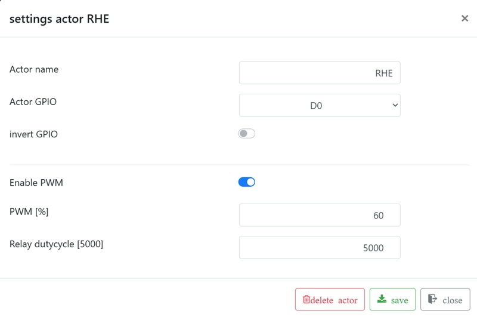
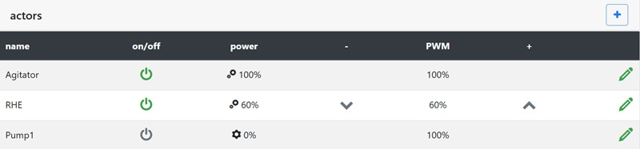

# Aktoren

Aktoren wie Rührwerk, Pumpen oder Ringheizelemente werden mit einem Namen und einem GPIO (Schalter) konfiguriert. Aktoren können PWM (Pulsweitenmodulation) verwenden. PWM im Brautomat bedeutet je nach PWM-Modus entweder getaktetes Ein-/Ausschalten oder ein analoges PWM-Signal.

Bei Relais bedeutet PWM ein getaktetes Ein- und Ausschalten zur
Leistungsregelung, nicht eine stufenlose Drehzahlregelung.

Für Relais und SSRs wird die digitale PWM verwendet. Die Leistung wird in Prozent angegeben. 100% bedeutet dauerhaft eingeschaltet. 50% bedeutet, dass der Ausgang innerhalb eines festen Zyklus jeweils zur Hälfte eingeschaltet und ausgeschaltet ist. Der digitale PWM-Zyklus ist fest auf 5000 ms eingestellt. Die Leistung wird in 5%-Schritten verarbeitet. Ein separater Dutycycle-Parameter wird für Aktoren nicht mehr konfiguriert.

Für analoges PWM wird ein festes PWM-Signal mit 1000 Hz verwendet. Dieser Modus ist für geeignete PWM-Eingänge gedacht, nicht für das Takten von Relais.

Die Leistung kann während des Betriebs mit den beiden Schaltflächen in der Aktorentabelle geändert werden. Die Schaltflächen zum Ändern der Leistung sind für jeden Aktor sichtbar, wenn PWM für den Aktor aktiviert wurde. Digitale PWM ist für Relais oder SSRs geeignet. Sie ist nicht als direkte Motorsteuerung für Rührwerke gedacht.

## Webhook

Der Parameter Aktor GPIO muss auf "-" eingestellt werden, damit die Webhook-Elemente im Webinterface angezeigt werden. Zusätzlich werden die Webhook-URL und das Schaltkommando benötigt:

Beispiel Shelly 1PM:

Shelly 1PM einschalten: [http://192.168.1.5/relay/0?turn=on](http://192.168.1.5/relay/0?turn=on)\
Shelly 1PM ausschalten: [http://192.168.1.5/relay/0?turn=off](http://192.168.1.5/relay/0?turn=off)

Die Webhook-URL für Shelly 1PM lautet: [http://192.168.1.5/relay/0?turn=](http://192.168.1.5/relay/0?turn=) (ohne on und off). Der Parameter Webhook-Schalter muss auf "on/off" eingestellt werden.

URL Tasmota: [http://192.168.1.5/cm?cmnd=Power1%201](http://192.168.1.5/cm?cmnd=Power1%201)
