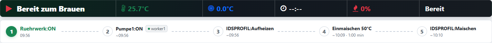
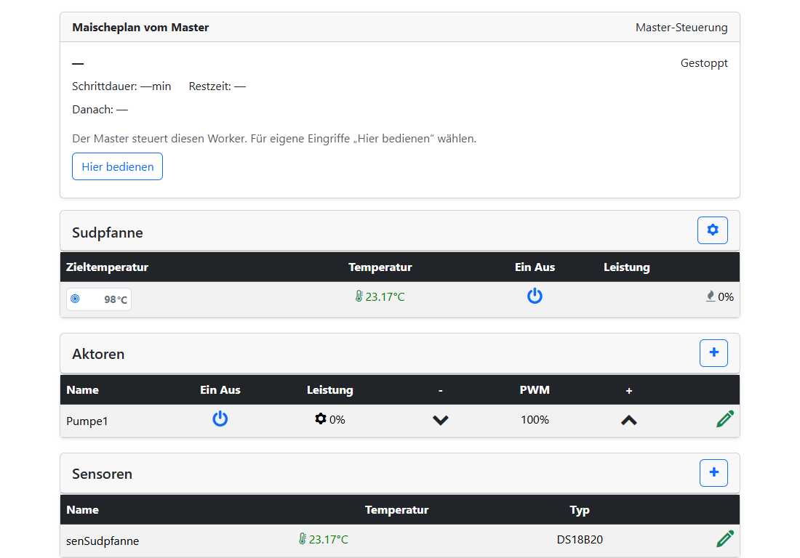
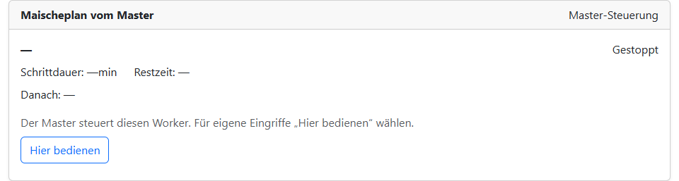

# MultiDevice bedienen

## Die gemeinsame Übersicht

Benutze für den gemeinsamen Braubetrieb das **Webinterface des Masters**.
Hier siehst du lokale und entfernte Sensorwerte, bedienst Aktoren und stellst
die Zieltemperaturen der ausgewählten Kessel ein.

Ein **Worker-Badge** zeigt die Herkunft eines entfernten Geräts. Lokale Geräte
bekommen kein Badge. Sensoren und Aktoren erscheinen in der Reihenfolge Master,
Worker1, Worker2, Worker3. Der Verbindungspunkt beschreibt die Verbindung,
nicht die Gültigkeit eines Messwerts und nicht den Erfolg eines Schaltauftrags.

Schaltaufträge werden vom Worker bestätigt. Bei einer Meldung wie
**„Kesselauftrag nicht bestätigt“** prüfst du zuerst den angezeigten Zustand
und das betroffene Gerät; eine Fehlermeldung allein beweist keinen AUS-Zustand.

*Die grünen Worker-Punkte zeigen eine bestehende Verbindung. In dieser Aufnahme ist der Braubetrieb gestoppt.*

## Maischeplan verwenden

Erstelle und starte den gemeinsamen Maischeplan am Master. Normale
Temperaturstufen verwenden den ausgewählten **MaischeSud-Kessel (ID 0)**,
auch wenn dieser auf einem Worker liegt. Eine Sudpfanne mit ID 1 wird durch
eine normale Maischerast nicht automatisch eingeschaltet.

Für Aktor-Sonderbefehle bleibt die Gerätezuordnung im Befehlsnamen erhalten:

| Beispiel | Wirkung |
| --- | --- |
| `Ruehrwerk:ON` | Lokales Rührwerk am Master einschalten |
| `master/Ruehrwerk:ON` | Derselbe lokale Auftrag mit ausdrücklicher Master-Angabe |
| `worker1/Pumpe1:ON` | Pumpe1 auf dem Gerät im Platz Worker1 einschalten |
| `worker2/Pumpe1:OFF` | Pumpe1 auf dem Gerät im Platz Worker2 ausschalten |

Verwende die tatsächlich eingerichteten Aktornamen. Gleiche Namen auf
verschiedenen Workern sind durch den Präfix unterscheidbar, auch wenn die
Anzeige statt des Präfixes ein Badge verwendet.

SUD- und HLT-Sonderbefehle verwenden die ausgewählte Kesselrolle. Beispielsweise
kann `HLT:Nachguss` mit Zieltemperatur 78 °C und Dauer 0 den Nachguss starten
und bei aktiviertem automatischem Schrittwechsel direkt weitergehen. Der
Auftrag bleibt über das Schrittende hinaus aktiv. Am Planende werden die
fortdauernden Kesselaufträge ausgeschaltet. Weitere Beispiele stehen unter
[Maischeplan-Funktionen](../Maischeplan/funktionen.md).

**Pause bedeutet nicht generell Heizung AUS.** Die bestehende Pausenlogik
bleibt auch in MultiDevice maßgeblich. Bei einer Pause können Kessel weiter
regeln; prüfe die jeweiligen Zustände.

*Der Auftrag „Pumpe1:ON“ trägt ein Worker1-Badge. Die Zeiten sind Vorschauwerte vor dem Braustart.*

## Anzeige am Worker

Die Karte **„Maischeplan vom Master“** zeigt den tatsächlichen Master-Schritt.
Bei Temperaturstufen gehören Ist-/Solltemperatur und Restzeit zu dessen
Prozesskessel. Das muss nicht der lokale Kessel dieses Workers sein.
Die eigene Kesselzeile zeigt dagegen den Zustand des lokalen Kessels.

Warte- und Sonderbefehle zeigen keine erfundenen Temperaturwerte. Unter
**„Danach“** erscheint der nächste Schritt beziehungsweise **„Planende“**.
Der Worker bleibt in seiner Tabellenansicht; die Karte ist keine zweite
editierbare Rezeptliste.

*Die Master-Planansicht steht oberhalb der lokalen Geräte. Bei gestopptem Plan stehen dort noch keine Schrittwerte.*

## Lokal übernehmen und zurückgeben

Unter Master-Steuerung sind die lokalen Schalt-, Sollwert- und Leistungsregler am Worker gesperrt. **Steuerung übernehmen** gibt sie frei. Die Übernahme allein pausiert den Master-Plan nicht. Ein abgeschlossener Aktor-Schaltauftrag verlangt keinen dauerhaft unveränderten Schaltzustand. Auch Sud/HLT-Hintergrundaufträge erlauben spätere lokale Bedienung. Benötigt der laufende Planschritt dagegen einen bestimmten Kesselzustand, bleibt eine Abweichung davon ein Prozesskonflikt. Neue Master-Aufträge werden während lokaler Bedienung weiterhin abgewiesen; bestehende Schutzfunktionen bleiben wirksam.

1. Öffne am Worker die Prozesskarte oder **System Einstellungen → MultiDevice**.
2. Wähle **Steuerung übernehmen** und bestätige die lokale Übernahme. Master-Aufträge
   werden gesperrt; die Übernahme selbst verändert keine Sollwerte oder Ausgänge.
3. Bediene die lokalen Geräte nach Bedarf. Eine lokale Übernahme startet keinen
   eigenen Worker-Maischeplan.
4. Wähle **Bedienung an Master zurückgeben**. Alternativ steht am Master beim
   verbundenen, lokal übernommenen Worker **Laufenden Zustand übernehmen** bereit.
5. Prüfe den angezeigten Zustand und bestätige. Die Rückgabe übernimmt ihn
   unverändert; ein vorheriges Ausschalten ist dafür nicht erforderlich.
6. Ist der Master-Plan pausiert, prüfe ihn und drücke am Master erneut **Pause**
   zum Fortsetzen. Dabei gilt wieder der Sollwert des Planschritts. Die Rückgabe
   allein setzt den Plan nicht fort; Play ist während der Pause gesperrt.

*„Steuerung übernehmen“ startet die bestätigte lokale Übernahme. Die Aufnahme zeigt den Ausgangszustand unter Master-Steuerung.*

Am Worker-Nextion kann Power auf der MaischeSud-/Brauseite die lokale Übernahme
anfordern: Play bestätigt, Pause bricht ab. Die Rückgabe erfolgt ausschließlich
über das Webinterface. Die Nextion-HMI-Firmware bleibt unverändert.

Bei Problemen weiter zu [Verbindung und Störungen](stoerungen.md).

### Maischekessel (ID 0) am Worker

Für diesen Kessel gilt der Zustand des Master-Maischeplans: Während der Plan
läuft, bleibt der Kessel-0-Konfigurationsabschnitt am Worker ausgeblendet und
gesperrt. Pausiere den Plan am Master, bevor du den Kessel änderst. In Pause
und bei gestopptem Plan ist der Abschnitt sichtbar und ohne zusätzliche lokale
Übernahme bearbeitbar. „Steuerung übernehmen“ umgeht die Pausepflicht nicht.
Der Maischeplan selbst wird weiterhin am Master im Editormodus geändert.
Ein nicht aktueller Master-Status gibt die Kesselbearbeitung nicht frei.
