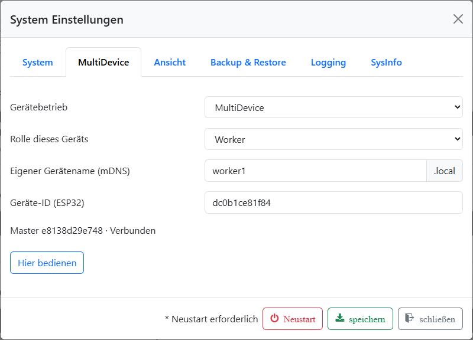

# MultiDevice einrichten

## Vorbereiten

Verwende auf allen beteiligten Brautomaten zueinander passende Firmware- und
Webdateistände. Für Geräte mit altem Partitionslayout ist zunächst die
Umstellung mit dem zur Beta passenden ServiceTool erforderlich; siehe
[Installation](../Installation/info.md). Richte jedes Gerät zunächst einzeln ein.

Alle Geräte müssen sich im selben lokalen Netzwerk erreichen können. Ein
Gastnetz oder eine WLAN-Einstellung, die Geräte voneinander isoliert, kann die
Suche und Verbindung verhindern. Die Brautomaten dürfen an unterschiedlichen
Access Points eines gemeinsamen Mesh-Netzes angemeldet sein.

Beende vor Rollen- und Zuordnungsänderungen den Braubetrieb. Richte Sensoren,
Aktoren und Kessel jeweils auf dem Brautomat ein, an dem sie angeschlossen sind.
Prüfe dort Sensorwerte, GPIO-Zuordnung und die erforderlichen PID-Einstellungen.

## 1. Worker vorbereiten

1. Öffne das Webinterface des vorgesehenen Workers.
2. Öffne **System Einstellungen → MultiDevice**.
3. Wähle bei **Gerätebetrieb** den Eintrag **MultiDevice** und als
   **Rolle dieses Geräts** den Eintrag **Worker**.
4. Vergib einen eindeutigen **eigenen Gerätenamen (mDNS)**, beispielsweise
   `maischekessel` oder `sudpfanne`. Verwende Kleinbuchstaben, Zahlen und
   Bindestriche, insgesamt 1–29 Zeichen. Kein Bindestrich am Anfang oder Ende;
   `.local` wird nicht mit eingegeben. `brautomat` ist für den Master reserviert.
5. Speichere die Einstellungen. Wiederhole das für weitere Worker.

Die angezeigte **Geräte-ID (ESP32)** identifiziert die Hardware. Der Gerätename
hilft dir beim Wiedererkennen, ersetzt aber diese Kennung nicht.

*Worker-Rolle, Gerätename und ESP32-Kennung am Worker. Dieses Gerät ist bereits einem Master zugeordnet.*

## 2. Master einrichten und Worker zuordnen

1. Öffne am vorgesehenen Master ebenfalls **System Einstellungen → MultiDevice**.
2. Wähle **MultiDevice** und die Rolle **Master**, prüfe den Gerätenamen und
   **speichere die Rolle zuerst**.
3. Öffne den Bereich erneut und wähle **Geräte suchen**.
4. Wähle für **Worker1** das gewünschte Gerät aus und aktiviere den Platz.
   Belege Worker2 und Worker3 nur, wenn du sie benötigst. Jeder Platz benötigt
   ein anderes Gerät.
5. Speichere und warte, bis die belegten Plätze **Verbunden** anzeigen.

Der Master fragt bei der Suche im lokalen Netzwerk nach anderen Brautomaten.
Diese antworten mit ihrer Gerätekennung. Ein Worker kann nur einem Master
zugeordnet sein.

**Worker1, Worker2 und Worker3 sind Plätze in der Master-Konfiguration.**
Ein Gerät mit dem Namen `sudpfanne` kann beispielsweise Worker2 sein. Die
Platznummer ist auch für Maischeplanbefehle und die Kesselpriorität maßgeblich.

*Einrichtung am Master: Worker1 ist aktiviert und verbunden; Worker2 und Worker3 bleiben frei.*

## 3. Kesselzuordnung prüfen

Im Verbund wird höchstens ein Kessel pro Rolle verwendet:

| Rolle | Kessel-ID | Aufgabe |
| --- | --- | --- |
| MaischeSud | 0 | Kessel für die normalen Temperaturstufen des Maischeplans |
| Sud | 1 | Zusätzlicher Sud-/Kochkessel |
| HLT/Nachguss | 2 | Nachgussbehälter |

Ein frei gewählter Kesselname ändert seine Rolle nicht. Für jeden Kessel muss
sein Sensor lokal am selben Brautomat eingerichtet sein.

Bei mehreren Kandidaten derselben Rolle wird im gestoppten Betrieb nach
**Master → Worker1 → Worker2 → Worker3** ausgewählt. Ein noch unbekannter Worker
blockiert die Auswahl nicht. Wird später ein höher priorisierter Kandidat
bekannt, übernimmt er im gestoppten Betrieb. Während Lauf oder Pause bleibt
die Auswahl fest. Weitere Kandidaten werden für diese Rolle im Verbund
ignoriert; ihre lokale Konfiguration bleibt erhalten.

Prüfe vor dem Start, welcher Brautomat jede Kesselrolle bereitstellt. Ein
vorübergehend nicht erreichbarer ausgewählter Worker wird nicht automatisch
durch einen anderen ersetzt.

Weiter mit [Bedienung](bedienung.md).
