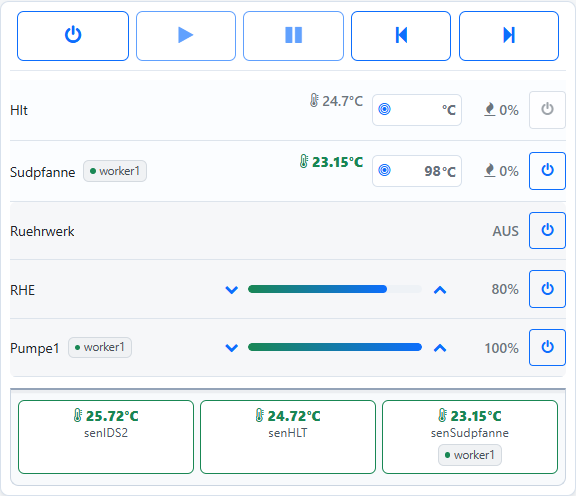

# MultiDevice

Mit MultiDevice verteilst du deine Brauanlage auf mehrere Brautomaten und
bedienst sie über das gemeinsame Webinterface eines Masters. Die Funktion
ist ab **1.67 Beta** verfügbar. Ein einzelner Brautomat bleibt weiterhin als
SingleDevice nutzbar.

## Master und Worker

Ein **Master** führt den Maischeplan und zeigt die gemeinsame Anlagenübersicht.
Bis zu **drei Worker** betreiben die vor Ort angeschlossenen Kessel, Sensoren
und Aktoren. Die Verbindung erfolgt über WLAN im selben lokalen Netzwerk.

| Beispiel | Angeschlossene Geräte |
| --- | --- |
| Master als Bedienstation | Optional ein Display; eigene Sensoren oder Kessel sind nicht erforderlich |
| Worker1 am Maischekessel | Temperatursensor, Kochfeld und Rührwerk |
| Worker2 an der Sudpfanne | Temperatursensor, Kochfeld und Pumpe |
| Worker3 am Nachgussbehälter | Temperatursensor und Heizung |

Das ist eine mögliche Aufteilung, keine feste Vorgabe. Der Master darf selbst
brauen, und mehrere Kesselrollen können auf demselben Brautomat liegen.
Kurze Sensor- und Steuerleitungen am jeweiligen Standort vereinfachen die
Verkabelung. Weitere Brautomaten schaffen zusätzliche Anschlüsse.

Jeder Worker kann ein eigenes Nextion-HMI-Display haben. Die Rückgabe der
Bedienung an den Master erfolgt über das Webinterface; dafür ist keine neue
Display-Schaltfläche vorgesehen.

*Beispiel mit einem verbundenen Worker: Sudpfanne, Pumpe1 und senSudpfanne sind am Worker angeschlossen.*

## Was gehört zum gemeinsamen Betrieb?

Der Master verwendet entfernte Sensorwerte, schaltet Aktoren und steuert die
ausgewählten Kessel über den Maischeplan. Die lokale Temperaturregelung eines
Worker-Kessels läuft auf diesem Worker. Sein Sensor muss ebenfalls dort
angeschlossen sein.

Der **manuelle Modus** und der **Fermentermodus** bleiben lokal. Der Worker
führt keinen zweiten unabhängigen Maischeplan neben dem Master aus.

## Weiterführende Seiten

- [Einrichtung](einrichtung.md): Geräte vorbereiten, Rollen wählen und Worker zuordnen.
- [Bedienung](bedienung.md): Anzeigen, Maischeplan und lokale Übernahme.
- [Verbindung und Störungen](stoerungen.md): Meldungen verstehen und Geräte ersetzen.
