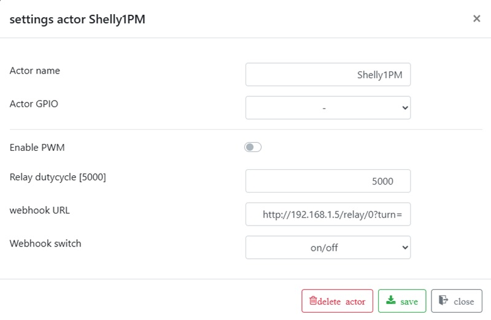

# Actuators

Actuators such as agitators, pumps, or ring heaters are configured with a name and a GPIO output. If needed, an actuator can use PWM (pulse-width modulation). In Brautomat, PWM means either timed on/off switching or an analog PWM signal, depending on the selected PWM mode.

For relays, PWM means timed on/off switching to control power, not continuous
speed control.

Power is entered in percent:

* 100% = always on
* 50% = equal on/off cycle in digital PWM mode

Digital PWM is intended for relays and SSR outputs. It uses a fixed 5000 ms cycle and processes power in 5% steps. There is no separate configurable duty-cycle parameter for actuators.

Analog PWM uses a fixed 1000 Hz PWM signal. This mode is intended for suitable PWM inputs, not for switching relays.

During operation, you can change power with the `+` and `-` buttons in the actuator table. These buttons are visible only when PWM is enabled for that actuator.

Digital PWM control is suitable for relays and SSR outputs. It is not intended as direct speed control for agitator motors.

## Webhook

Set the actuator GPIO parameter to `-` to show webhook fields in the web interface. Then enter the base URL and the switching command:

Example: Shelly 1PM

Turn on Shelly 1PM: [http://192.168.1.5/relay/0?turn=on](http://192.168.1.5/relay/0?turn=on)\
Turn off Shelly 1PM: [http://192.168.1.5/relay/0?turn=off](http://192.168.1.5/relay/0?turn=off)

Webhook base URL for Shelly 1PM: [http://192.168.1.5/relay/0?turn=](http://192.168.1.5/relay/0?turn=) (without `on` and `off`). The webhook switch parameter should be set to `on/off`.

Tasmota example URL: [http://192.168.1.5/cm?cmnd=Power1%201](http://192.168.1.5/cm?cmnd=Power1%201)
