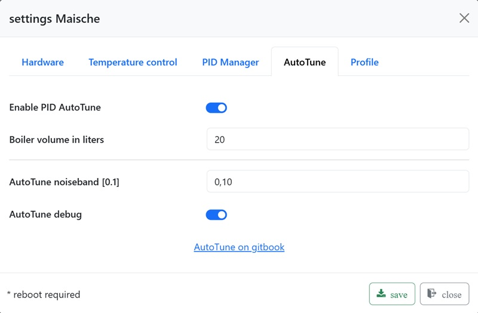
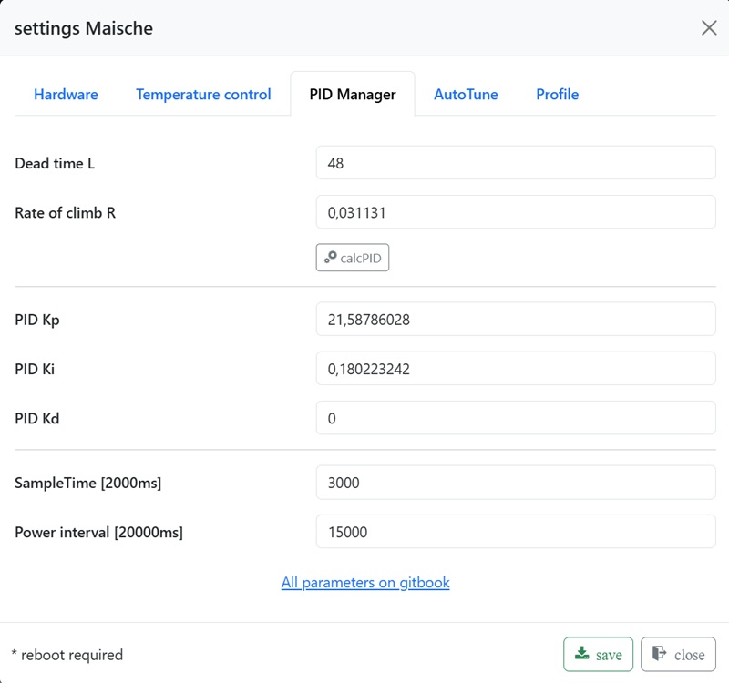

# AutoTune step by step

> **Safety note:** Before the first heating run, complete the
> [safety check before the first heat test](../Installation/safety-check-first-heat-test.md).

The practical AutoTune workflow:

1. Fill your mash kettle with a typical amount of water.

   a. A typical amount corresponds to your usual brew-day fill: strike water
   plus grain bill.

   Example: 16 l strike water and 4 kg grain bill result in a typical
   AutoTune amount of 20 l water.

   b. Water temperature should be around 50°C (40°C to 55°C).

   c. Turn on the agitator.
2. Enter the typical volume in `Kettle volume in liters`.
3. Enable `PID AutoTune`.
4. Enable `AutoTune debug`.
5. Save the setting.
6. Start AutoTune with the power button.

AutoTune takes about 5 minutes and stops automatically. The detected system
parameters are saved automatically. The AutoTune result is dead time `L` and
slope `R`. PID values are derived from these values.

When AutoTune is complete and `AutoTune debug` is enabled, use the file
explorer to inspect `autotune_log.txt`. This file records the full process.
The files `idsAutoTune.txt`, `sudAutoTune.txt`, and `hltAutoTune.txt` contain
the AutoTune result as JSON. They are informational and are not required for
normal operation.
