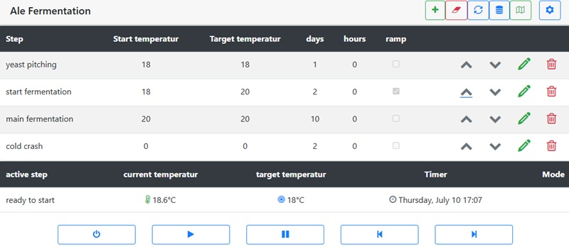
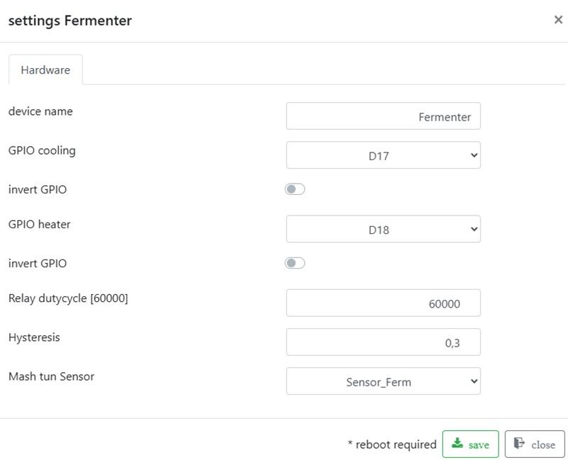

# Fermenter

In fermenter mode, Brautomat32 processes the fermentation plan from top to bottom, similar to the mash plan. The control panel uses the same buttons.

There is one important difference in step handling:

The first fermentation step starts immediately when the process starts. All following steps start when the previous step ends, independent of actual temperature.

After a manual step change with Next, press Play once to start the selected step. Pause a running fermentation plan before editing it. Reordering preserves the active step and its remaining time. Its name must be unique before and after editing; deleting or renaming this step during the run is rejected.

Step duration accepts days, hours and minutes. If another browser saves a changed plan, an open draft is preserved. Saving a stale draft is rejected; reload the current plan and enter the desired changes again.

For setup, you can configure one GPIO for cooling and one GPIO for heating. Either one can also be left unused.

The fermenter has three states: cooling, heating, and idle. If the controller switches between heating and cooling, a pause is inserted. During this pause, the output state stays unchanged.

* Old status cooling and new status cooling: no pause. The cooling remains switched on
* Old status heating and new status heating: no pause. Heating stays on
* Old status cooling and new status heating: pause 120s
* Old status heating and new status cooling: pause 120s

## Ramp

A fermenter step is specified with a start and an end temperature. In the first figure in this section, the temperature in the first fermenter step is 18°C. Of course, this means that the fermentation temperature remains unchanged for a period of 1 day.

In the second fermenter step, start temperature is 18°C and end temperature is 20°C with a duration of 2 days. There are two ways to handle this:

When ramp is enabled, Brautomat adjusts temperature linearly over the step duration. In this example it raises temperature from 18°C to 20°C in +0.1°C steps over 2 days.

With ramp disabled, the target end temperature is applied immediately at step start and then held.

## Relay switching cycle

The relay switching cycle determines how long one of the cooling, heating or idle states is held. The permitted value range is between 1000 and 240000ms. The default is 120000, i.e. 120 seconds. A switching cycle that is too small can have a negative impact on cooling devices.

## Display

In fermenter mode, use the Mash view (page 2). Kettle overview and manual control view are not used in fermenter mode.

## Temperature display and connection

Valid actual and target temperatures of 0 °C and below are displayed; -1 °C is
also a valid reading. Invalid values appear as gaps in the chart. Older saved
chart histories may still show -1 °C as a gap. Nextion also displays valid target
temperatures of 0 °C and below.

Stop the process with Power before switching between mash and fermenter views;
pausing alone is insufficient. A browser without unsaved edits automatically
loads newly saved fermentation plans. Note any desired changes before reloading
a stale draft, as reloading discards the draft.
