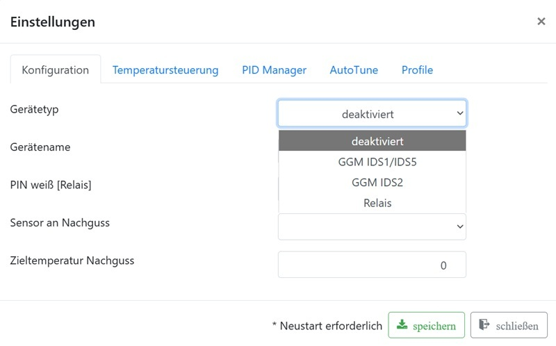

# Set up a relay kettle

This guide applies to a kettle whose heater is switched through a suitable
relay or SSR. It is the beginner path for relay setups; webhook and
multi-kettle configurations come later.

> **Safety:** Work on mains voltage belongs in qualified hands. Use only
> components suitable for the load, switching method, and installation. Always
> complete the [safety check](../Installation/safety-check-first-heat-test.md)
> before the first heating run.

## Prerequisites

- A temperature sensor is already configured and reports plausible values.
- The switching output is wired safely to the relay or SSR.
- A shutdown option is reachable at all times.
- The first test is performed with water and under supervision.

## 1. Create the mash kettle

1. In **Mash plan**, open the gear icon in the upper right corner.
2. On the **Configuration** tab, select **Relay** as **Device type**.
3. Give the device a clear name, for example `Mash`.
4. Under **PIN white [Relay]**, select the output that is actually wired.
5. Assign the temperature sensor configured earlier.
6. Save the settings and restart Brautomat if the interface asks you to do so.

## 2. Safe functional test

Before AutoTune and the first brew day, run a short test with water:

1. Check the displayed actual temperature once more.
2. Start a moderate heating test and observe relay, heater, and temperature
   rise.
3. Stop the test with the power button and verify that heating switches off.

If switching is unexpected, temperature is implausible, or heating does not
switch off: stop immediately and check wiring and configuration.

## 3. Set up control

On the **PID Manager** tab, select **Relay PID mode** for a relay-driven
kettle. It uses the `Ku` and `Pu` values found by AutoTune to calculate PID
values.

For the following AutoTune run:

- use the typical water fill of the future brew day;
- start with the relay/SSR AutoTune noise band of `0.5` provided in the
  parameters;
- then follow [AutoTune step by step](../Autotune-pid/steps.md).

[Kettle parameters](../Parameter/parameter-kessel.md) explain further settings
such as maximum power, sensor-error power, and AutoTune parameters.

## Next

After the successful water and AutoTune test, continue with
[PID instructions](../Kessel/PID-Anleitung.md) and
[The Mash Plan](../Maischeplan/info.md).

For additional kettles, webhooks, or special control commands, see
[Kettle configuration and use](../Kessel/kessel.md).
