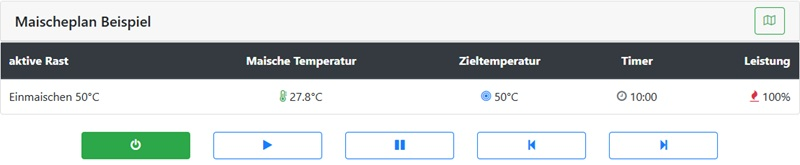

# The Control

The control panel is located directly below the mash plan. The mashing process is operated with five buttons: `Power`, `Play`, `Pause`, `Previous`, `Next`.

## Power button

Starts or stops the mash process. If PID AutoTune is enabled for a kettle, the same button starts/stops AutoTune.

## Play button

Play has two functions:

1. Start rest timer for current step, independent of actual temperature.
2. Continue with the next step when `autonext` (automatic switch to the next
   step) is disabled. The button is shown in red.

Example: In a boil step, actual temperature may stay below target (for example 98.5°C vs 100°C). `Play` lets you start timing manually when boiling is already sufficient.

## Pause button

Pause behavior depends on process phase.

### During heating to next rest

* editing controls become visible again
* heating continues toward target
* pause indicator turns red

This is useful if you need to adjust mash steps while heating.

### During active rest

* rest timer pauses
* temperature control stays active
* heating remains controlled around the setpoint

Pause time is added to total rest duration.

## Previous button

Jumps to previous mash step. If process was stopped, the current rest timer is reset and starts again.

## Next button

Jumps to next mash step. If current step is the last one, mash process ends.

## Collapse button

Shows/hides the mash plan table.

The collapse button remains available during brewing. Edit buttons are hidden once brewing starts.

## Immediate commands and restart recovery

When a timed step without AutoNext finishes, the next step is selected.
If it is an immediate command, Play executes it. Play acknowledges an immediate
command without AutoNext only after that command has executed.

Restart recovery does not automatically execute immediate or kettle commands.
Saved pauses and remaining time are retained. Immediate commands have no
persistent execution record: explicitly pressing Play may repeat a command
that already executed before the restart.
