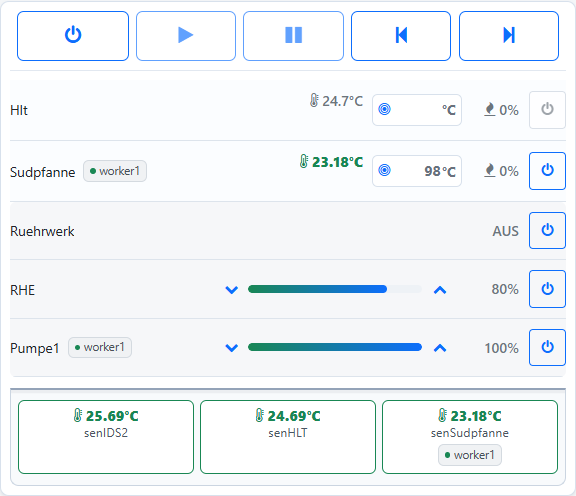

# MultiDevice

MultiDevice lets you distribute your brewery across several Brautomat units
and operate them through a Master's shared web interface. It is available
from **1.67 Beta**. A single Brautomat can still be used in SingleDevice mode.

## Master and Workers

One **Master** runs the mash plan and provides the combined overview.
Up to **three Workers** operate their locally connected kettles, sensors and
actuators. They communicate over Wi-Fi on the same local network.

| Example | Connected equipment |
| --- | --- |
| Master as a control station | Optional display; local sensors or kettles are not required |
| Worker1 at the mash kettle | Temperature sensor, hob and stirrer |
| Worker2 at the boil kettle | Temperature sensor, hob and pump |
| Worker3 at the hot liquor tank | Temperature sensor and heater |

This is an example, not a fixed assignment. The Master can operate brewing
equipment itself, and several kettle roles can be located on the same unit.
Short local sensor and control connections simplify wiring. Additional
Brautomat units provide more connections.

Each Worker can have its own Nextion HMI display. Returning control to the
Master uses the web interface; no new display button is planned for this.

*Example with one connected Worker: Sudpfanne, Pumpe1 and senSudpfanne are connected to the Worker.*

## What is shared?

The Master uses remote sensor readings, switches actuators and controls the
selected kettles through the mash plan. A Worker kettle's temperature control
runs locally on that Worker. Its sensor must also be connected there.

**Manual mode** and **fermenter mode** remain local. A Worker does not run a
second independent mash plan alongside the Master.

## Next steps

- [Setup](setup.md): prepare devices, select roles and assign Workers.
- [Operation](operation.md): displays, mash plans and local takeover.
- [Connections and troubleshooting](troubleshooting.md): understand messages and replace devices.
