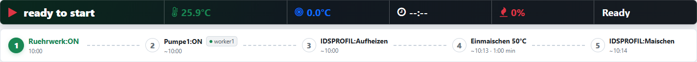
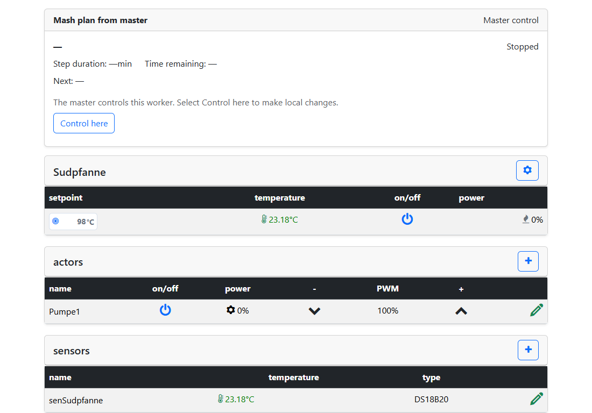
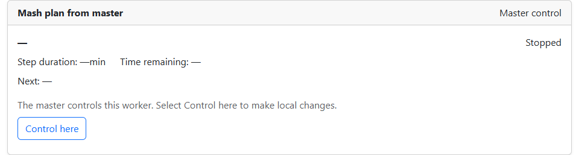

# Operate MultiDevice

## The combined overview

Use the **Master's web interface** for shared brewing operations. It displays
local and remote sensor readings, lets you operate actuators and set target
temperatures for the selected kettles.

A **Worker badge** identifies the source of remote equipment. Local equipment
has no badge. Sensors and actuators are listed in Master, Worker1, Worker2,
Worker3 order. The connection dot describes connectivity, not whether a sensor
reading is valid or a switching command has succeeded.

Workers confirm switching commands. If a message reports an unconfirmed kettle
command, first check the displayed state and the actual device. An error
message alone does not prove that its outputs are off.

*Green Worker dots indicate an established connection. Brewing is stopped in this screenshot.*

## Use the mash plan

Create and start the shared mash plan on the Master. Normal temperature steps
use the selected **mash/boil kettle (ID 0)**, including when it is on a Worker.
A boil kettle with ID 1 is not automatically switched on by a normal mash rest.

Actuator special commands retain the device assignment in their command names:

| Example | Effect |
| --- | --- |
| `Ruehrwerk:ON` | Switch on the Master's local actuator named Ruehrwerk |
| `master/Ruehrwerk:ON` | The same local command with an explicit Master prefix |
| `worker1/Pumpe1:ON` | Switch on Pumpe1 on the device assigned to Worker1 |
| `worker2/Pumpe1:OFF` | Switch off Pumpe1 on the device assigned to Worker2 |

Use the actuator names actually configured on your units. Prefixes distinguish
identical names on different Workers, even when the display uses badges instead.

SUD and HLT special commands use the selected kettle role. For example,
`HLT:Nachguss` with a target temperature of 78 °C and duration 0 can start
the HLT and proceed immediately if automatic step advance is enabled.
The command remains active beyond that step. Continuing kettle commands are
switched off at plan end. See [Mash plan functions](../Maischeplan/funktionen.md)
for further examples.

**Pause does not generally mean heating OFF.** MultiDevice retains the existing
pause behaviour. Kettles may continue regulating during a pause; check their
individual states.

*The “Pumpe1:ON” command carries a Worker1 badge. Times are estimates before brewing starts.*

## The Worker's display

The **Mash plan from Master** card shows the actual Master step. For temperature
steps, actual/target temperatures and remaining time refer to that step's
process kettle. This need not be the Worker's local kettle. The separate local
kettle row shows the state of that local kettle.

Wait and special-command steps do not display invented temperature readings.
The next step or plan end appears below the current step. The Worker remains
in its table view; this card is not a second editable recipe list.

*The Master plan card appears above local equipment. A stopped plan does not yet show step values.*

## Take local control and return it

Under Master control, local switching, target-temperature and power controls on the Worker are locked. **Take control** enables them. Taking local control alone does not pause the Master plan. A completed actor switching command does not require its switch state to remain unchanged indefinitely. Sud/HLT background commands also allow subsequent local operation. If the active plan step requires a particular kettle state, changing that state remains a process conflict. New Master commands are still rejected during local control; existing protection functions remain effective.

1. On the Worker, open the process card or **System settings → MultiDevice**.
2. Select **Take control** and confirm local takeover. Master commands are
   blocked; takeover itself changes neither setpoints nor outputs.
3. Operate local equipment as needed. Local takeover does not start a separate
   Worker mash plan.
4. Select **Return control to master**. Alternatively, the Master offers
   **Take over the current state** for a connected Worker under local control.
5. Review the displayed state and confirm. Returning control preserves that
   state; switching equipment off beforehand is not required.
6. If the Master plan is paused, check it and press **Pause** again on the
   Master to resume. The plan step's target temperature applies again.
   Returning control alone does not resume the plan; Play is disabled during pause.

*“Take control” starts the confirmed local takeover. This screenshot shows the initial state under Master control.*

On a Worker's Nextion mash/brew page, Power can request local takeover:
Play confirms, Pause cancels. Returning control is available only through the
web interface. The Nextion HMI firmware remains unchanged.

For problems, see [Connections and troubleshooting](troubleshooting.md).

### Mash kettle (ID 0) on a Worker

This kettle follows the Master's mash-plan state. While the plan is running,
the Worker's kettle-0 configuration section is hidden and locked. Pause the
plan on the Master before changing this kettle. When paused or stopped, the
section is visible and editable without an additional local takeover.
“Take control” does not bypass the pause requirement. Edit the mash plan itself
on the Master in editor mode. A stale Master status does not unlock kettle editing.
