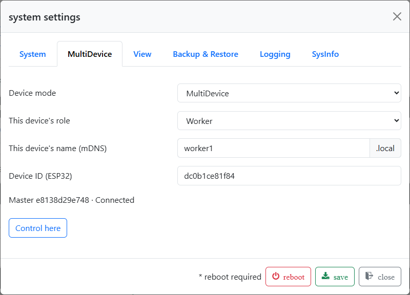

# Set up MultiDevice

## Preparation

Use compatible firmware and web files on all participating Brautomat units.
Devices with the old partition layout must first be migrated using the
ServiceTool version intended for this beta; see [Installation](../Installation/info.md).
Set up each device individually first.

All devices must be able to reach each other on the same local network.
A guest network or Wi-Fi client isolation can prevent discovery and connections.
The units may connect to different access points within a shared mesh network.

Stop brewing before changing roles or assignments. Configure sensors, actuators
and kettles on the unit to which they are connected. Check sensor readings,
GPIO assignments and the required PID settings locally.

## 1. Prepare the Workers

1. Open the intended Worker's web interface.
2. Open **System settings → MultiDevice**.
3. Set **Device mode** to **MultiDevice** and **This device's role** to **Worker**.
4. Enter a unique **device name (mDNS)**, such as `mash-kettle` or `boil-kettle`.
   Use lowercase letters, digits and hyphens, 1–29 characters in total. Do not
   start or end with a hyphen or include `.local`. The name `brautomat` is
   reserved for the Master.
5. Save the settings. Repeat for additional Workers.

The displayed **device ID (ESP32)** identifies the hardware. The device name
helps you recognise it, but does not replace this identifier.

*Worker role, device name and ESP32 identifier on the Worker. This unit is already assigned to a Master.*

## 2. Configure the Master and assign Workers

1. On the intended Master, open **System settings → MultiDevice**.
2. Select **MultiDevice** and the **Master** role, check the device name and
   **save the role first**.
3. Reopen the section and select **Find devices**.
4. Choose the device for **Worker1** and enable that slot. Use Worker2 and
   Worker3 only if needed. Each slot requires a different device.
5. Save and wait until the occupied slots show **Connected**.

During discovery, the Master asks for other Brautomat units on the local
network. They respond with their device identifiers. A Worker can be assigned
to only one Master.

**Worker1, Worker2 and Worker3 are slots in the Master's configuration.**
A device named `boil-kettle` could be Worker2. The slot number also determines
how mash plan commands address it and its kettle selection priority.

*Master setup: Worker1 is enabled and connected; Worker2 and Worker3 remain unused.*

## 3. Check kettle assignments

The combined setup uses at most one kettle for each role:

| Role | Kettle ID | Purpose |
| --- | --- | --- |
| Mash/boil (MaischeSud) | 0 | Kettle used by normal mash plan temperature steps |
| Boil (Sud) | 1 | Additional boil kettle |
| HLT | 2 | Hot liquor tank |

A custom kettle name does not change its role. Each kettle's sensor must be
configured locally on the same Brautomat.

If several candidates provide the same role, selection while stopped follows
**Master → Worker1 → Worker2 → Worker3**. An unknown Worker does not block
selection. If a higher-priority candidate becomes known later, it takes over
while the plan is stopped. Assignments remain fixed during a running or paused
plan. Other candidates are ignored for that shared role; their local
configuration is preserved.

Before starting, check which Brautomat provides each kettle role. A temporarily
unreachable selected Worker is not automatically replaced by another one.

Continue with [Operation](operation.md).
