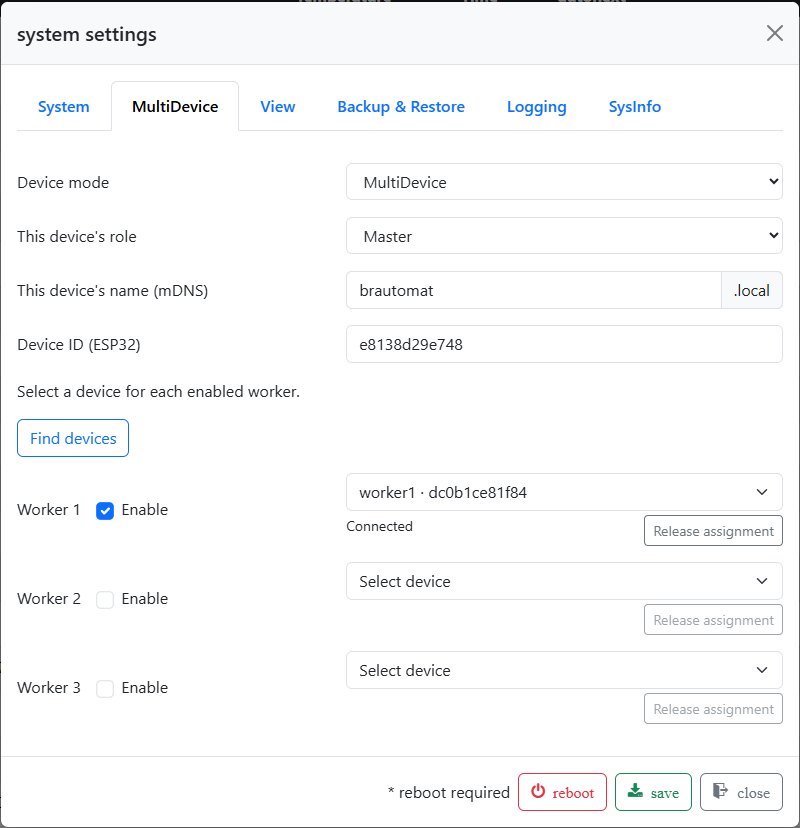

# Connections and troubleshooting

## Understanding messages

| Message | What to check |
| --- | --- |
| Save the role first | Save the selected Master/Worker role, then reopen discovery |
| Not assigned to a Master | Select, enable and save the Worker on the intended Master |
| Bound to another Master | Explicitly release the previous assignment before changing Masters |
| Not connected / Unreachable | Check power, Wi-Fi and whether the device is reachable |
| Stale reading | Check the connection and sensor on the relevant Brautomat; do not treat the old value as a current measurement |
| Sensor error | Check the sensor and its local configuration |
| Switching/kettle command not confirmed | Check the current device state; a click alone does not confirm success or shutdown |
| Control state unknown | Restore connectivity and check who has control before issuing further commands |

If discovery fails, check that Master and Workers share a local network and
are allowed to communicate. If a device name fails, also try its displayed
IP address. A name resolution failure alone does not prove Wi-Fi disconnected.

Error toasts remain visible until manually closed. Closing a notification
acknowledges the display, but does not resolve a device or connection fault.

## Connection loss during brewing

Check the messages and plan state on the Master. Another Worker does not
automatically take over the affected kettle. Reconnecting does not mean a
paused plan should resume automatically.

For Worker kettles operating under a Master plan's remote authorisation,
this beta uses a provisional **ten-second period without renewed authorisation**;
the corresponding temperature control is then stopped. This is not a general
guarantee that all actuators and outputs switch off after ten seconds.
Explicitly confirmed local takeover ends that remote supervision and permits
local operation.

If you need to continue locally and can operate the Worker, use
[Take control](operation.md#take-local-control-and-return-it). If its web
interface is unavailable too, an installed display can provide the supported
local controls. Check the actual state of your equipment.

If switching off is not confirmed, the plan remains locked. Check the affected
devices and then use **Retry switching off**.

## Replace a Worker

### The previous device is reachable

Stop the process completely and put the affected device into the required
off state. On the Master, open **System settings → MultiDevice**, select
**Release assignment** for that Worker and wait for confirmation. You can
then select, enable and save a different device.

### The previous device has permanently failed

1. End the running or paused plan.
2. Make sure on site that the failed Worker and its connected loads are safely
   out of operation.
3. On the Master, select **Remove failed worker** and confirm the notice.
4. Assign a replacement if needed, then check kettle roles and plan commands
   before starting a new run.

**Removal does not confirm that outputs are off.** The Master abandons that
Worker's outstanding commands. The old device is not automatically added back
if it returns; explicitly assign it before using it again.

*“Release assignment” is available for a reachable Worker. This screenshot shows a connected Worker; removing a failed unit is described separately above.*
