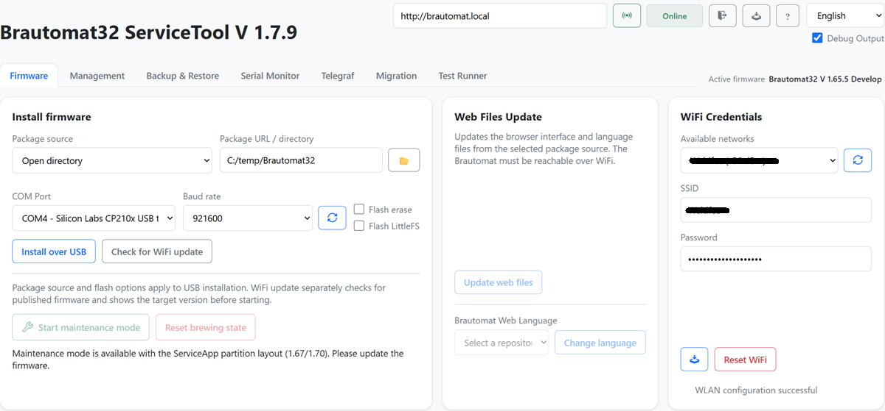
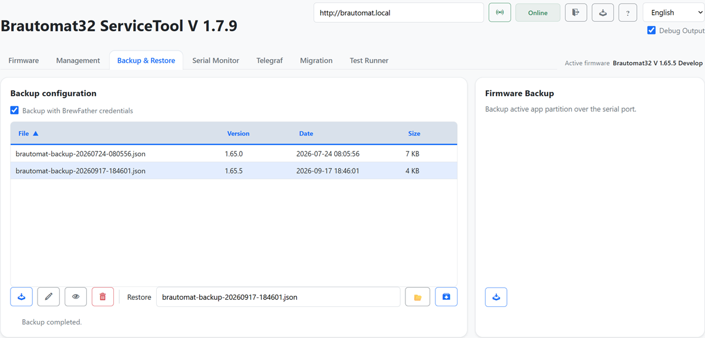
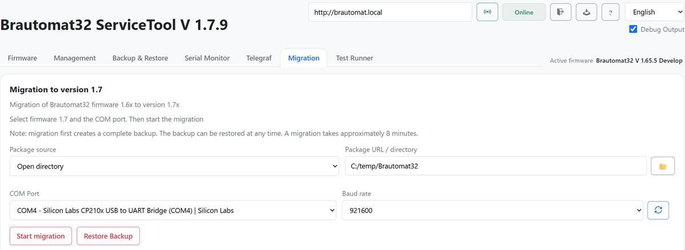

# Migration to 1.67 Beta

This quick guide covers the **one-time migration from the previous partition
layout to the new layout with ServiceApp**. Normal web updates are available
afterwards. Devices already using the matching new layout do not need another
layout migration.

> You need **ServiceTool version 1.7.6 or newer**
> and the complete matching beta package. An older ServiceTool that only accepts
> 1.70.x as its migration target is not suitable. This is not a normal web
> update; a single `firmware.bin` is not sufficient.

## 1. Connect the device

Stop brewing and connect the Brautomat to your computer using a USB data cable.
Open ServiceTool and select the correct port and device address. The existing
Brautomat must also be reachable over Wi-Fi. Wait until ServiceTool identifies
the correct device as **Online**.

*Image 1: ServiceTool with the port, device address and Online status highlighted.*

## 2. Back up your data

Create a backup under **Backup & Restore** and keep it on your computer.
Check that your settings, custom recipes and profiles are backed up; save any
additional custom files separately. Keep the backup until migration has
completed successfully.

*Image 2: Backup & Restore – creating a backup and the successful result.*

## 3. Select the beta package

Under **Firmware**, select the complete package provided for this beta.
For a locally supplied package, extract it first and select its folder using
**Open directory**. The package includes the new partition layout, main
firmware, ServiceApp and matching web files.

*Image 3: Firmware – package source and selected beta package folder.*

## 4. Start migration

Open **Migration**. Check the device and target version, then select
**Start migration**. Wait for the entire workflow, including backup,
flashing, reboot and restoration, to finish.

**Do not disconnect power or USB, or close ServiceTool during the process.**
Continue only when migration has completed successfully and the Brautomat
is reachable again.

*Image 4: Migration – start button, followed by the successful completion message.*
<!-- SCREENSHOT 4: Migration; split into start and result images if needed -->

## 5. Check the result

- Reload the Brautomat web interface and check for **version 1.67.0**.
- Check Wi-Fi, sensor readings, kettle assignments, actuators, profiles and recipes.
- Use the provided restore workflow to recover any missing data from your backup.
- Check the functions of your setup before your next brew day.

ServiceApp is the maintenance area on the Brautomat. After migration, the normal
main firmware and its web interface should be running again. Configure MultiDevice
afterwards if required; migrate and check each additional unit individually.
A single Brautomat can still be used on its own.

*Image 5: Brautomat web interface after migration, with the firmware version visible.*
<!-- SCREENSHOT 5: Final check in the Brautomat web interface -->

## If something goes wrong

Save the error message and the ServiceTool log. Do not erase flash or try a
different package without identifying the problem. If Wi-Fi is unavailable,
check the port and credentials in ServiceTool. Include the tool version,
the package used and the saved log when asking for help.
