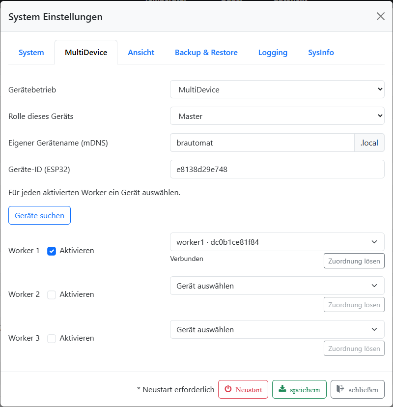
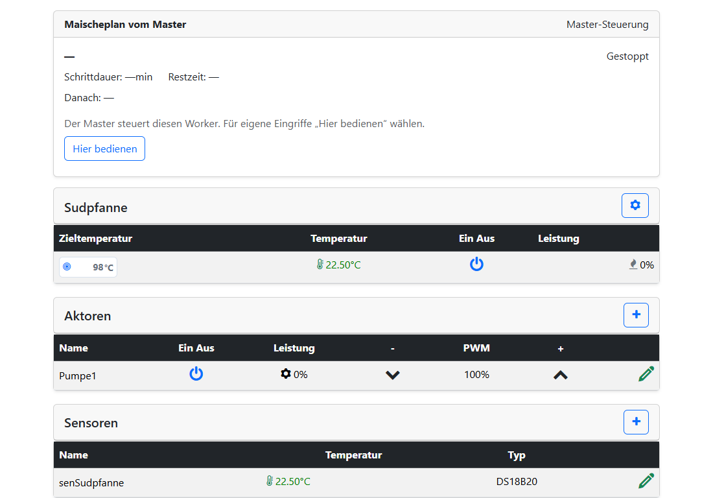
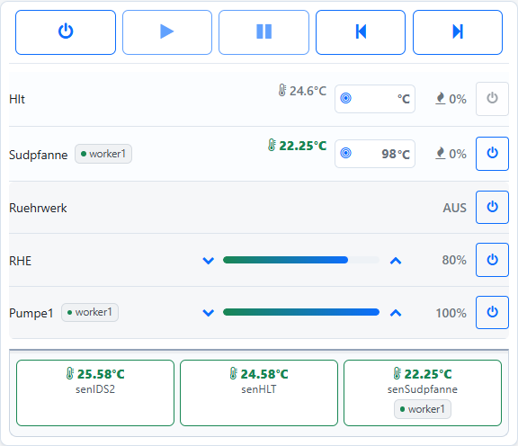
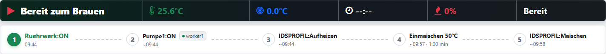
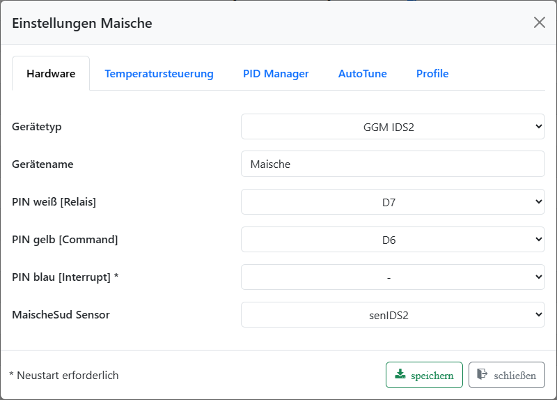

# Was ist neu: Brautomat32 1.67.0 Beta

Mit **1.67.0** startet die erste Beta mit **MultiDevice, neuem Partitionslayout
und ServiceApp**. Ihr könnt eure Brauanlage auf mehrere Brautomaten verteilen
und gemeinsam bedienen. Gleichzeitig erhält die Hauptfirmware mehr Platz und
einen eigenen Wartungsbereich für Updates und Wiederherstellung.

Die Datei heißt bereits `whats_new_170.de.md`; die hier beschriebene Version ist
**1.67.0 Beta**, nicht 1.70 und keine Umstellung auf ESP-IDF 6.

## MultiDevice: eine Anlage, mehrere Brautomaten

Ein **Master** übernimmt die gemeinsame Bedienung. Bis zu **drei Worker**
stellen ihre Kessel, Sensoren und Aktoren bereit. Die Verbindung erfolgt über
WLAN im lokalen Netzwerk.

Damit könnt ihr eure Anlage nach Aufgaben oder Standort aufteilen: beispielsweise
ein Worker am Maischekessel, einer an der Sudpfanne und einer am Nachgussbehälter.
Sensor- und Steuerleitungen enden am Brautomat vor Ort. Das vereinfacht die
Verkabelung und schafft zusätzliche Anschlussmöglichkeiten.

- Der Master darf auch eine reine Bedienstation ohne angeschlossene Geräte sein.
- Der Master sucht andere Brautomaten im lokalen Netzwerk. Ihre individuelle
  ESP32-Kennung unterscheidet die Geräte unabhängig vom Namen.
- Im gemeinsamen Webinterface zeigen kleine Worker-Badges, wo ein Gerät
  angeschlossen ist. Lokale Geräte am Master benötigen kein Badge.
- Der Maischeplan kann Kessel und Aktoren auf den Workern verwenden.
- Jeder Worker kann ein eigenes Nextion-HMI-Display haben. Eine Änderung der
  Nextion-HMI-Firmware ist für diese Erweiterung nicht vorgesehen.
- Im Webinterface des Workers zeigt eine kompakte Planansicht den aktuellen
  Master-Schritt, Temperaturen, Schrittdauer, Restzeit und den nächsten Schritt.

Wer nur einen Brautomat verwendet, kann seine Anlage weiterhin als SingleDevice
betreiben. MultiDevice ist optional.

*MultiDevice am Master: Worker1 ist zugeordnet und verbunden. Zwei weitere Worker-Plätze sind noch frei.*

### Kessel und Bedienung

Im Verbund wird jeweils **ein Kessel pro Rolle** verwendet: MaischeSud, Sud und
HLT/Nachguss. Die Rollen sind nicht fest an Master oder bestimmte Worker gebunden.
Der Temperatursensor eines Kessels muss am selben Brautomat angeschlossen sein.

Sind mehrere Kessel derselben Rolle eingerichtet, gilt im gestoppten Betrieb die
Priorität **Master → Worker1 → Worker2 → Worker3**. Während eines laufenden oder
pausierten Plans bleibt die Zuordnung fest. Ein Verbindungsabbruch führt nicht
automatisch zur Auswahl eines anderen Kessels.

Für eigene Eingriffe am Worker lässt sich die Bedienung mit **„Steuerung übernehmen“**
lokal übernehmen. Die Rückgabe an den Master erfolgt über das Webinterface nach
Zustandsabgleich. Die Rückgabe selbst verändert weder Sollwerte noch Ausgänge;
ein pausierter Maischeplan wird anschließend ausdrücklich fortgesetzt.
Manueller Modus und Fermentermodus bleiben lokal.

*Direkt am Worker: oben die Master-Planansicht, darunter die angeschlossenen Geräte. Der Plan ist hier gestoppt.*

## Mehr Übersicht beim Brauen

- Einheitliche Bedienelemente für lokale und entfernte Kessel und Aktoren.
- Temperatur und Steigrate übersichtlich angeordnet; bei ausgeschaltetem Kessel
  wird keine Steigrate eingeblendet.
- Laufend nachgeführte Zeitprognose für kommende Maischeplanschritte. Sie bleibt
  eine ungefähre Orientierung: Nicht vorgegebene Wartezeiten, etwa beim Läutern,
  können erst berücksichtigt werden, wenn ihr tatsächlich fortfahrt.
- Error-Toasts bleiben sichtbar, bis ihr sie selbst schließt.

*Gemeinsam im Dashboard: lokale Geräte sowie Sudpfanne, Pumpe1 und Sensor von Worker1. Die Worker-Badges zeigen die Zuordnung und den Verbindungsstatus.*

*Der Zeitstrahl zeigt den Auftrag „Pumpe1:ON“ mit Worker1-Badge. Der Maischeplan ist noch nicht gestartet; die Zeiten sind Vorschauwerte.*

## Neues Partitionslayout und ServiceApp

Der Flash-Speicher wird neu aufgeteilt: Die Hauptfirmware erhält einen größeren
Bereich, daneben liegt die separate **ServiceApp**. Sie übernimmt Wartungsaufgaben
wie das Einspielen der Hauptfirmware sowie das Sichern und Wiederherstellen von
Dateien. Während die ServiceApp läuft, findet kein Braubetrieb statt.

ServiceApp und ServiceTool sind zwei verschiedene Dinge: Die **ServiceApp läuft
auf dem Brautomat**, das **ServiceTool auf eurem Computer**. Das normale WebUpdate
der Hauptfirmware nutzt nach der Umstellung die ServiceApp.

### Einmalige Umstellung über das ServiceTool

**Der Wechsel vom bisherigen Partitionslayout ist kein normales WebUpdate.**
Eine einzelne `firmware.bin` genügt dafür nicht. Verwendet das zur Beta passende
ServiceTool und das vollständige, zusammengehörige Beta-Paket einschließlich
Partitionstabelle, Hauptfirmware, ServiceApp und Webdateien.

1. Den Braubetrieb beenden und den Brautomat per USB mit dem Computer verbinden.
   Im ServiceTool den richtigen Port und das richtige Gerät auswählen. Für die
   Übernahme bestehender Daten muss das bisherige Webinterface erreichbar sein.
2. Eine Sicherung erstellen und auf dem Computer aufbewahren. Einstellungen,
   Rezepte und Profile müssen auch dann verfügbar bleiben, wenn die Umstellung
   unterbrochen wird.
3. Den Migrationsablauf der passenden ServiceTool-Version mit dem Beta-Paket
   verwenden. Dabei werden das neue Layout und die zugehörigen Images eingerichtet.
   USB-Verbindung und Stromversorgung währenddessen bestehen lassen.
4. Nach der Umstellung die Übernahme der WLAN-Daten und die Wiederherstellung
   der gesicherten Einstellungen prüfen; nötigenfalls die Sicherung über den
   vorgesehenen Restore-Ablauf einspielen.
5. Vor dem ersten Brauen Sensorzuordnung, Kessel, Aktoren, Profile und Maischeplan
   prüfen. Anschließend bei Bedarf Master und Worker einrichten. Jedes beteiligte
   Gerät benötigt einen zueinander passenden Firmware- und Webdateistand.

**Voraussetzung für diese Beta:** Das verwendete ServiceTool muss die Migration
auf **1.67.0 mit ServiceApp** ausdrücklich unterstützen. Ältere Tool-Versionen,
die ausschließlich 1.70.x als Migrationsziel erwarten, sind hierfür nicht geeignet.
Der Dateiname dieser Neuigkeiten ist keine Freigabe für ein anderes Updatepaket.

## Optionaler IDS-Rückkanal

Die GPIO-Auswahl für den Interrupt des GGM-IDS-Kochfelds (blaues Kabel) ist wieder
verfügbar. **Standardmäßig ist der Interrupt deaktiviert** und kann bei Bedarf
aktiviert werden.

Zur Verringerung von Fehlmeldungen werden Fehler erst nach drei gleichen,
aufeinanderfolgenden empfangenen Codes angezeigt. `0000` bedeutet OK. Die Meldung
allein pausiert keinen Plan und schaltet weder Heizung noch Relais automatisch ab.
Das Verhalten wird anhand der Rückmeldungen aus der Praxis weiter bewertet.

*„PIN blau [Interrupt]“ steht auf „–“: Der optionale Rückkanal ist deaktiviert.*

## Stand der Beta

Automatisierte Prüfungen und erste Gerätetests begleiten die Entwicklung.
Die Erprobung an realen Brauanlagen, mit mehreren Workern und unterschiedlichen
WLAN-Aufbauten wird zeigen, wo noch Anpassungen nötig sind.

Für Rückmeldungen helfen die Firmwareversionen, der Aufbau mit Master/Workern,
der betroffene Schritt und eine kurze Beschreibung des beobachteten Verhaltens.
