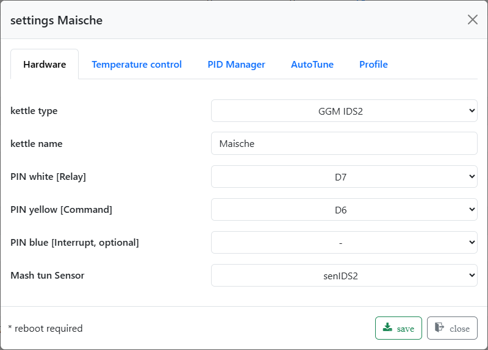

# What's new: Brautomat32 1.67.0 Beta

**1.67.0** is the first beta with **MultiDevice, a new partition layout and
ServiceApp**. You can distribute your brewery across several Brautomat units
and operate them together. The main firmware also gains more space and a
dedicated maintenance area for updates and recovery.

This file is already named `whats_new_170.md`; the version described here is
**1.67.0 Beta**, not 1.70 and not a migration to ESP-IDF 6.

## MultiDevice: one brewery, several Brautomat units

One **Master** provides the shared controls. Up to **three Workers** provide
their kettles, sensors and actuators. The units communicate over Wi-Fi on your
local network.

You can split your setup by function or location: for example, one Worker at the
mash kettle, another at the boil kettle and a third at the hot liquor tank.
Sensor and control wiring connects to the nearby Brautomat. This simplifies
wiring and provides additional connections for equipment.

- The Master can be a control station with no equipment connected to it.
- The Master searches for other Brautomat units on the local network. Their
  individual ESP32 identifiers distinguish them independently of their names.
- Small Worker badges in the shared web interface show where equipment is
  connected. Local equipment on the Master does not need a badge.
- The mash plan can use kettles and actuators on Workers.
- Each Worker can have its own Nextion HMI display. No changes to the
  Nextion HMI firmware are planned for this extension.
- A compact plan view in the Worker's web interface shows the current Master
  step, temperatures, step duration, remaining time and the next step.

If you use a single Brautomat, you can continue operating it as a SingleDevice
setup. MultiDevice is optional.

*Worker1 is assigned and connected. Two more Worker slots are available.*

### Kettles and controls

The combined setup uses **one kettle per role**: mash/boil (MaischeSud), boil
(Sud), and hot liquor tank (HLT). These roles are not tied to the Master or a
particular Worker. A kettle's temperature sensor must be connected to the same
Brautomat as the kettle.

If several kettles are configured for the same role, selection while the plan
is stopped follows **Master → Worker1 → Worker2 → Worker3**. Assignments remain
fixed while a plan is running or paused. A connection failure does not
automatically select a different kettle.

To make local adjustments on a Worker, select **“Take control”**. Return control to the Master
through the web interface after the states have been reconciled. Returning
control itself changes neither setpoints nor outputs; a paused mash plan is
then resumed explicitly. Manual mode and fermenter mode remain local.

*The Master plan card sits above the local equipment. The plan is stopped in this screenshot.*

## A clearer view of your brew

- Consistent controls for local and remote kettles and actuators.
- Temperature and rate of temperature change arranged clearly; the rate is
  hidden when a kettle is switched off.
- Continuously updated estimates for upcoming mash plan steps. These remain
  approximate: unspecified waiting times, such as during lautering, can only
  be accounted for when you actually continue.
- Error toasts remain visible until you close them yourself.

*Local equipment and the Worker’s kettle, pump and sensor appear together. Worker badges identify their source.*

*The “Pumpe1:ON” command shows its Worker assignment. Times are estimates before brewing starts.*

## New partition layout and ServiceApp

Flash memory is divided differently: the main firmware gets a larger area,
with a separate **ServiceApp** alongside it. ServiceApp handles maintenance
tasks such as installing the main firmware and backing up or restoring files.
Brewing does not run while ServiceApp is active.

ServiceApp and ServiceTool are different components: **ServiceApp runs on the
Brautomat**, while **ServiceTool runs on your computer**. After migration, the
main firmware's normal web update uses ServiceApp.

### One-time migration using ServiceTool

**Changing from the previous partition layout is not a normal web update.**
A single `firmware.bin` is not sufficient. Use the ServiceTool version intended
for this beta and its complete, matching beta package, including the partition
table, main firmware, ServiceApp and web files.

1. Stop brewing and connect the Brautomat to your computer by USB. Select the
   correct port and device in ServiceTool. The existing web interface must be
   reachable to transfer your current data.
2. Create a backup and keep it on your computer. Settings, recipes and profiles
   must remain available even if migration is interrupted.
3. Use the migration workflow in the matching ServiceTool version with the beta
   package. It installs the new layout and the associated images. Keep USB and
   power connected throughout the operation.
4. After migration, check that Wi-Fi credentials and your saved settings have
   been restored. If necessary, use the provided restore workflow to apply
   your backup.
5. Before brewing, check sensor assignments, kettles, actuators, profiles and
   the mash plan. Then configure Master and Workers if required. All units
   taking part need compatible firmware and web files.

**Requirement for this beta:** ServiceTool must explicitly support migration
to **1.67.0 with ServiceApp**. Older tool versions that only accept 1.70.x as
the migration target are not suitable. The name of this news file does not
authorize the use of a different update package.

## Optional IDS feedback channel

GPIO selection for the GGM IDS hob's interrupt input (blue wire) is available
again. **The interrupt is disabled by default** and can be enabled if needed.

To reduce false alarms, an error is displayed only after three identical codes
have been received consecutively. `0000` means OK. The notification itself does
not pause a plan or automatically switch off heating or a relay. Feedback from
real installations will guide further evaluation of this behaviour.

*The blue-wire interrupt pin is set to “–”: the optional feedback channel is disabled.*

## Beta status

Development is supported by automated checks and initial device tests.
Trials on real breweries, with several Workers and different Wi-Fi setups,
will help identify where further adjustments are needed.

When reporting an issue, please include the firmware versions, your Master/Worker
setup, the affected step and a short description of what happened.
